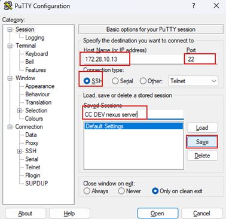
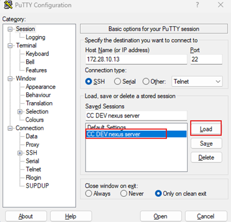
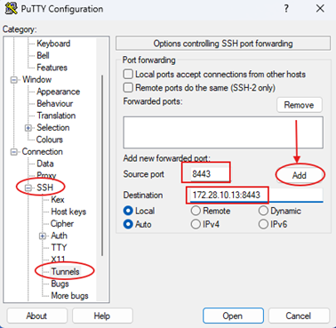
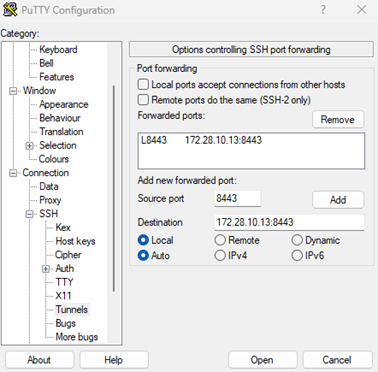
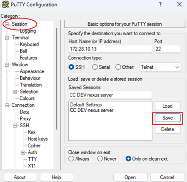
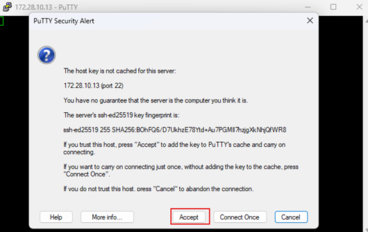
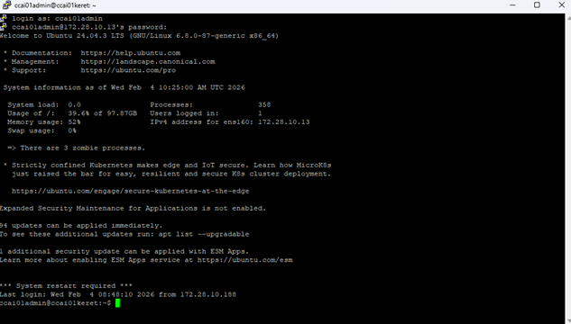

# CC DEV SZERVER ELÉRÉS PUTTY-AL

A PuTTY program segítségével konfigurálunk egy SSH‑tunnel‑t, amelyen keresztül elérhetjük a Nexus szervert.

Rövid magyarázat:

PuTTY‑t indítunk – ez a Windows‑os SSH‑kliens.
SSH‑tunnel‑t (port‑tunnel) állítunk be a PuTTY konfigurációs ablakában (Connection → SSH → Tunnels).
Megadjuk a célportot és a célhostot (itt a Nexus szerver IP‑címe vagy neve).

Elindítjuk a kapcsolatot, így a helyi gépünkön egy megadott porton keresztül (a tunnel) elérhetjük a Nexus szervert, mintha közvetlenül kapcsolódnánk hozzá.

Ezt követően be töltsük be:

Konfigoljuk:

Ezt kell látnunk:

Ezt követően elmentjük a beállításokat:

Ezután megnyitjuk az Open gombbal (ezt csak CC-s VPN-en keresztül érjük el!!!)

Majd be kell lépnünk, akkor ezt kell látni:

Már elérhetőek a docker image-ek a saját nexus repositroy-ból. Bővebb információ a a Nexus fejezetben található.

