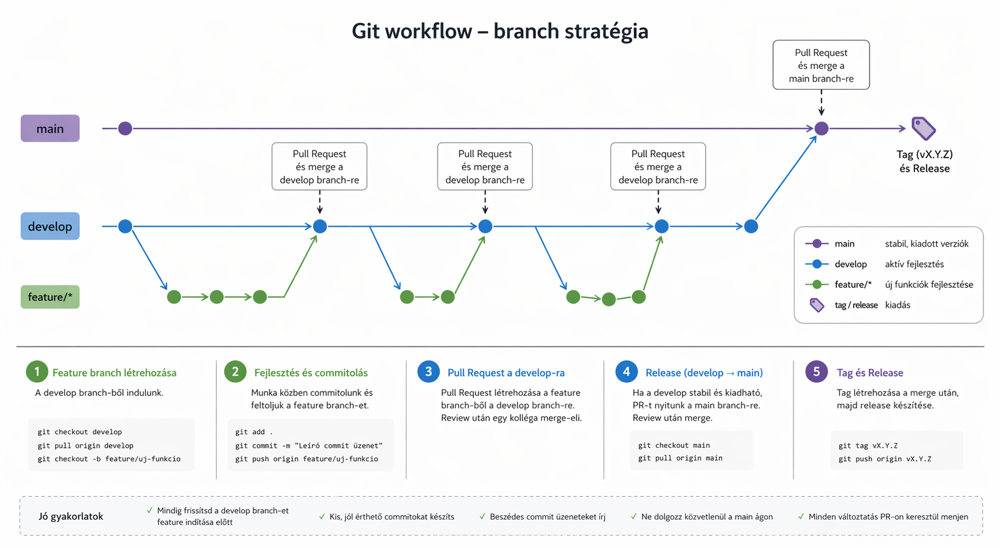
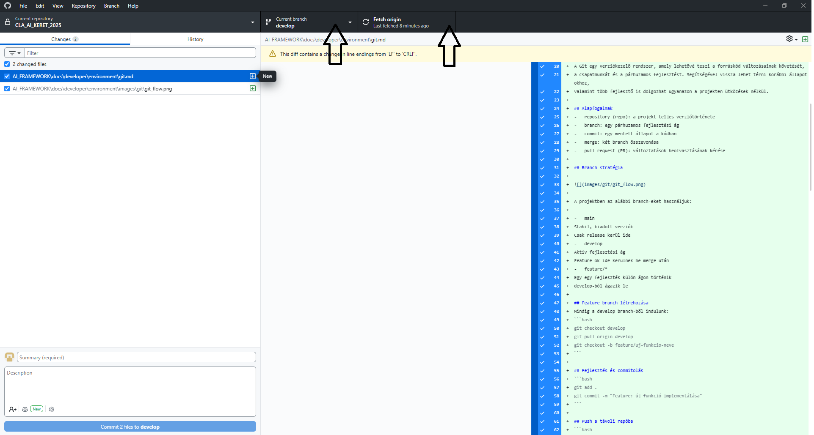

# Git folyamat kialakítása

**Dátum:** 2026.04.23.  
**Verzió:** v1.0  
**Szerző:** Zelina Attila  

---

## Dokumentum kontroll

| Dátum       | Verzió | Szerző        | Megjegyzés                                   |
|------------|--------|---------------|----------------------------------------------|
| 2026.04.23 | 1.0    | Zelina Attila | Első draft verzió                            |


---


## Git használat és fejlesztési folyamat
A Git egy verziókezelő rendszer, amely lehetővé teszi a forráskód változásainak követését, 
a csapatmunkát és a párhuzamos fejlesztést. Segítségével vissza lehet térni korábbi állapotokhoz, 
valamint több fejlesztő is dolgozhat ugyanazon a projekten ütközések nélkül.

## Alapfogalmak
-	repository (repo): a projekt teljes verziótörténete
-	branch: egy párhuzamos fejlesztési ág
-	commit: egy mentett állapot a kódban
-	merge: két branch összevonása
-	pull request (PR): változtatások beolvasztásának kérése

## Branch stratégia



A projektben az alábbi branch-eket használjuk:

**Main**

- Stabil, kiadott verziók  
- Csak release kerül ide  

**Develop**

- Aktív fejlesztési ág  
- Feature-ök ide kerülnek be merge után  

**Feature/\***

- Egy-egy fejlesztés külön ágon történik  
- Develop-ból ágazik le

## Feature branch létrehozása
Mindig a develop branch-ből indulunk:
```bash
git checkout develop
git pull origin develop
git checkout -b feature/uj-funkcio-neve
```

## Fejlesztés és commitolás
```bash
git add .
git commit -m "Feature: új funkció implementálása"
```

## Push a távoli repóba
```bash
git push origin feature/uj-funkcio-neve
```

## Pull Request létrehozása
- A feature branch-ből PR-t nyitunk a develop branch-re
- Egy kolléga review után merge-eli

## Develop frissítése (lokálisan)
Merge után:
```bash
git checkout develop
git pull origin develop
```

## Pull Request a develop → main irányba
Ha release kész:
- PR nyitása: develop → main
- Review és merge

## Verzió tag létrehozása
Merge után:

```bash
git checkout main
git pull origin main
git tag v1.0.0
git push origin v1.0.0
```

## Release létrehozása
- Git platformon (pl. GitHub / GitLab) release létrehozása a tag alapján
- Release note-ok hozzáadása

## Hasznos parancsok
Branch lista

```bash
git branch
git branch -r
git branch -a
```

Branch váltás
```bash
git checkout branch-nev
```

Új branch létrehozás és váltás
```bash
git checkout -b branch-nev
```

Távoli változások lehúzása
```bash
git pull origin branch-nev
```

Push
```bash
git push origin branch-nev
```
GitHub desktop használata



Jó gyakorlatok

- Mindig frissítsd a develop branch-et feature indítása előtt
- Kis, jól érthető commitokat készíts
- Beszédes commit üzeneteket írj
- Ne dolgozz közvetlenül a main branch-en
- Minden változtatás PR-on keresztül menjen


Példák névkonvenciókra:

-	feature/user-authentication 
-	feature/payment-integration 

## Git konfig beállítások

Az alábbi paranccsal lekérhetjük, hogy milyen git konfigurációk vannnak beállítva a gépünkön, pl.: user.name vagy user.email

```bash
git config --global --list
```

Az AI keretrendszernél fontos, hogy az alábbi Linux-os beállítás legyen, mivel a konténerek futtatásánál lényeges (Feltöltéskor LF-re konvertál, letöltéskor nem módosít).
Linux/macOS:
```bash
git config --global core.autocrlf input
```

Ha Windows-os sorvég-karakterre van szükség, akkor az alábbi konfiguráció kell (Feltöltéskor LF-re konvertál, letöltéskor CRLF-et használ).
Windows:
```bash
git config --global core.autocrlf true
```


