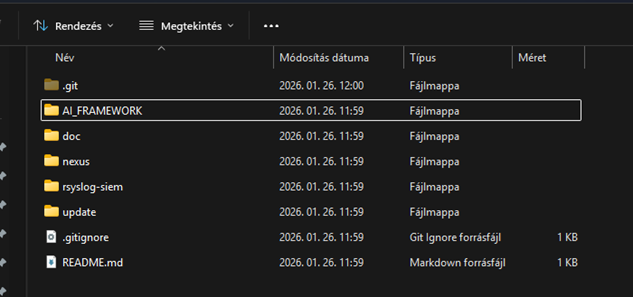
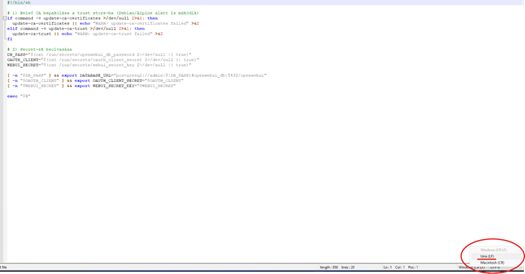
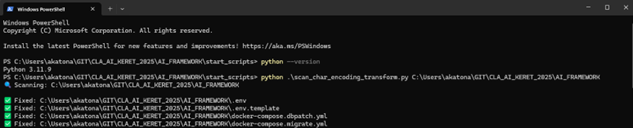
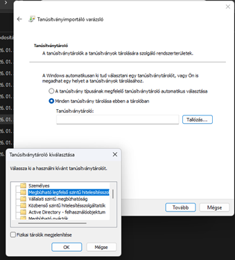
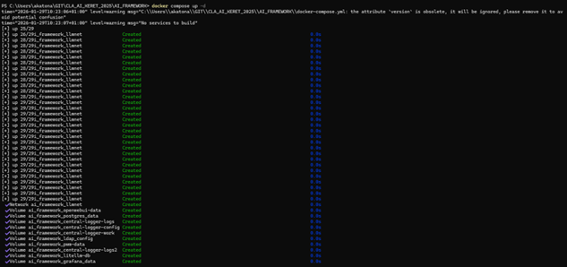
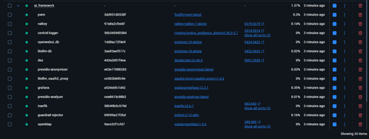

# Előfeltétel

Előfeltétel, hogy Python(3.10 vagy annál nagyobb verzió) és Docker Desktop telepítve legyen a gépedre. Gitből lehúzzuk a CLA_AI_KERET_2025 develop branchet, ebben fogunk dolgozni (lehetőleg valami hasonló helyre töltsük le, pl.: C:\Users\username\GIT\CLA_AI_KERET_2025)
Gitből, amikor a develop branch lejött, valami hasonlót kell látnod:



FONTOS! Az AI_FRAMEWORK mappában a „.sh” és a „.yml” kiterjesztéseket Unix karakterkódolásra kell állítani, ez a következő fejezetben elvégezzük python script segítségével, de érdemes odafigyelni erre, mivel hibát okozhat az image futtatásánál.



# PYTHON SCRIPTEK FUTTATÁSA

Az AI_FRAMEWORK\start_scripts mappába navigálunk és első lépésként ellenőrizzük, hogy jogosultak vagyunk-e pythont futtatni a start_scripts mappából, ehhez futtatjuk a python --version parancsot. 
Ekkor meg kell, hogy jelenjen a python verzió, ami telepítve van és fel van véve a környezeti változók közé a Path-ba.
Nyitunk egy Windows PowerShell-t és futtatjuk a következő parancsokat:



A python script elvégzi nekünk a szükséges állományok karakterkódolásának Unixra állítását, a parancs amit futtatni kell :

```bash
python .\scan_char_encoding_transform.py <DIRECTORY>
```

A következő lépésként végrehajtjuk a readme.txt-be leírt lépéseket:
Mappa kiválasztás:
Lépjünk a GIT\CLA_AI_KERET_2025\AI_FRAMEWORK és nyissunk egy Windows PowerShell-t(ne sima CMD-t)
Futtasuk a következő parancsot:

Python check:
```bash
python --version
```

Python venv létrehozása és aktiválása
```bash
python -m venv venv
	.\venv\Scripts\Activate.ps1(Ha sikerült aktiválni, akkor egy (venv) jelenik meg a sor elején)
```

Python check:
```bash
python --version
```

# TANUSÍTVÁNYOK TELEPÍTÉSE

A certs mappába lépve találunk 2 .crt kiterjesztésű fájlt, ezeket telepítjük a saját gépünkre a Tárolás helye az „Aktuális felhasználó” és a Minden tanusítvány tárolása ebben a tárolóban opciót választjuk, majd Tallózásnál a „Megbízható legfelső szintű hitelesítésszolgáltatók” opciót választjuk.



Majd ha a tanusítványokat telepítettük, akkor a, host_example.txt alapján beállítjuk a :
c:\Windows\System32\Drivers\etc\hosts állományban az eléréseket, annyi különbséggel, hogy az IP címeket cseréljük le 127.0.0.1 -re.
Példa:

```bash
{{host_file_openwebui}}
{{host_file_ldapadmin}}
{{host_file_litellm}}
{{host_file_traefik}}
{{host_file_ssoai}}
{{host_file_grafana}}
{{host_file_passwd}}
{{host_file_vault}}
{{host_file_docs}}
{{host_file_nexus}}
```

# DOCKER INDÍTÁSA

A certs mappába lépve találunk 2 .crt kiterjesztésű fájlt, ezeket telepítjük a saját gépünkre a Tárolás helye az „Aktuális felhasználó” és a Minden tanusítvány tárolása ebben a tárolóban opciót választjuk, majd Tallózásnál a „Megbízható legfelső szintű hitelesítésszolgáltatók” opciót választjuk.

Navigáljunk az AI_FRAMEWORK mappába, a futtatási parancsát ott kell kiadnunk, ahol a docker-compose.yml állomány található. A docker image-et az AI_FRAMEWORK mappából terminálban tudjuk indítani a következő paranccsal (ha töltesz le olyan image-t ami a cc-s nexusban van, akkor a 12. fejezete):
  - docker compose up -d ->(indítás)
  - docker compose ps ->(listázás)
  - docker compose down -v ->(leállítás, a volumot is törli)
  - docker compose down ->  (leállítás)

Ha minden rendben lefutott akkor a következőt látjuk a terminálban:



A docker desktopban pedig ez látható:




