# Grafana

## Cél

A `grafana` a monitoring és dashboard felület.

## Compose szerep

- image: `grafana/grafana:12.3.1`
- container_name: `grafana`
- restart: `unless-stopped`

## Routing

Traefik route:
- host: `${GRAFANA_DOMAIN}`
- target port: `3000`

## Fő konfiguráció

A compose alapján:
- OIDC auth Dexen keresztül
- signup tiltva
- login form tiltva
- group alapú hozzáférés
- Grafana admin szerepkiosztás groups alapján

## Mountok

- `grafana_data:/var/lib/grafana`
- `./grafana/grafana-secrets.sh:/grafana-secrets.sh:ro`
- `vault-secrets:/secrets:ro`

## Indítás

A service a `grafana-secrets.sh` entrypoint scriptet használja.

## Fejlesztői megjegyzések

Külön leírandó:
	- datasource konfigurációk
	- dashboardok
	- OIDC mapping
	- provisioning stratégia

## Grafana konfiguráció 

Ez a dokumentum tartalmazza a Grafana alap konfigurációját és a szükséges Data Source-ok beállítását.

## Előfeltételek

- Futó Grafana instance
- Futó PostgreSQL adatbázis 
- Futó Loki service
- Docker Compose környezet 

## Grafana elérése

Alapértelmezett URL:

Prod: {{grafana_prod_url}}

Dev: {{grafana_dev_url}}

Plugin neve: grafana-postgresql-datasource

## Beállítások

| Field         | Érték              |
|---------------|--------------------|
| Host URL      | `litellm-db:5432`  |
| Database name | `litellm`          |
| User          | ( litellm user)    |
| Password      | (adatbázis jelszó) |
| TLS/SSL Mode  | disable            |

Mentés:
Save & Test
Siker esetén: ✅ Database Connection OK

## Loki Data Source hozzáadása
Connections → Data Sources → Add data source

Típus: Loki

## Prometheus Data Source hozzáadása
Connections → Data Sources → Add data source

Típus: Prometheus

## Dashboard létrehozása

    Create → Dashboard
    → Add new panel
    → Data source kiválasztása (PostgreSQL vagy Loki)
    → Query konfigurálása

## Hibaelhárítás

    PostgreSQL nem csatlakozik
        Ellenőrizd a container network-öt
        Pingeld a service nevet: docker exec -it grafana ping litellm-db

    Loki nem elérhető
        Ellenőrizd a 3100-as portot
        Nézd meg a logokat: docker logs loki


## Ellenőrzési lista

-  PostgreSQL data source mentve
-  Loki data source mentve
-  Save & Test sikeres
-  Dashboard létrehozva

## Grafana Compose

```bash    
  grafana:
    image: grafana/grafana:12.3.1
    container_name: grafana
    restart: unless-stopped
    networks: [ llmnet ]
    environment:
      TZ: "${TZ:-Europe/Budapest}"
      GF_SERVER_ROOT_URL: "https://${GRAFANA_DOMAIN}"
      GF_USERS_ALLOW_SIGN_UP: "false"
      GF_AUTH_DISABLE_LOGIN_FORM: "true"
      GF_AUTH_BASIC_ENABLED: "false"
      GF_AUTH_GENERIC_OAUTH_ENABLED: "true"
      GF_AUTH_GENERIC_OAUTH_NAME: "${SSO_PROVIDER_NAME:-Comp SSO}"
      GF_AUTH_GENERIC_OAUTH_CLIENT_ID: "grafana"
      GF_AUTH_GENERIC_OAUTH_SCOPES: "openid profile email groups"
      GF_AUTH_GENERIC_OAUTH_AUTH_URL: "https://${SSO_DOMAIN}/dex/auth"
      GF_AUTH_GENERIC_OAUTH_TOKEN_URL: "http://dex:5556/dex/token"
      GF_AUTH_GENERIC_OAUTH_API_URL: "http://dex:5556/dex/userinfo" 
      GF_AUTH_GENERIC_OAUTH_GROUPS_ATTRIBUTE_PATH: "groups"
      GF_AUTH_GENERIC_OAUTH_ALLOWED_GROUPS: "${GRAFANA_ALLOWED_GROUPS}"
      GF_AUTH_GENERIC_OAUTH_ROLE_ATTRIBUTE_PATH: "contains(groups[*], '${GRAFANA_ALLOWED_GROUPS}') && 'GrafanaAdmin' || 'None'"
      GF_AUTH_GENERIC_OAUTH_ALLOW_ASSIGN_GRAFANA_ADMIN: "true"
      GF_AUTH_GENERIC_OAUTH_ROLE_ATTRIBUTE_STRICT: "true"
      GF_AUTH_GENERIC_OAUTH_AUTH_STYLE: "InHeader"
      GF_AUTH_LOGIN_MAXIMUM_LIFETIME_DURATION: "${SESSION_EXPIRE}" 
      GF_AUTH_LOGIN_MAXIMUM_INACTIVE_LIFETIME_DURATION: "${SESSION_EXPIRE}" 
      GF_AUTH_TOKEN_ROTATION_INTERVAL_MINUTES: "1"
    volumes:
      - grafana_data:/var/lib/grafana
      - ./grafana/grafana-secrets.sh:/grafana-secrets.sh:ro
      - vault-secrets:/secrets:ro
    entrypoint: ["/bin/sh", "/grafana-secrets.sh"]
    labels:
    - "traefik.enable=true"
    - "traefik.http.routers.grafana.rule=Host(`${GRAFANA_DOMAIN}`)"
    - "traefik.http.routers.grafana.entrypoints=websecure"
    - "traefik.http.routers.grafana.tls=true"
    - "traefik.http.services.grafana.loadbalancer.server.port=3000"
    extra_hosts:
      - "${SSO_DOMAIN}:host-gateway" 
```

### Alap adatok

| Tulajdonság    | Érték                  | Magyarázat                                                    |
| -------------- | ---------------------- | ------------------------------------------------------------- |
| Service név    | grafana                | A Compose-on belüli logikai név (`http://grafana:3000`).      |
| Image          | grafana/grafana:12.3.1 | Stabil Grafana verzió (érdemes fixen tartani production-ben). |
| Konténer név   | grafana                | Fix név debughoz (`docker logs grafana`).                     |
| Restart policy | unless-stopped         | Automatikusan újraindul hiba esetén.                          |
| Hálózat        | llmnet                 | Belső kommunikációs hálózat (Dex, datasource-ok).             |


### Környezeti változók (SSO + Security)

| Változó                    | Jelentés                |
| -------------------------- | ----------------------- |
| GF_USERS_ALLOW_SIGN_UP     | Regisztráció tiltása    |
| GF_AUTH_DISABLE_LOGIN_FORM | Login form kikapcsolása |
| GF_AUTH_BASIC_ENABLED      | Basic auth tiltása      |

### OAuth / OIDC (Dex integráció)

| Változó                         | Jelentés                              |
| ------------------------------- | ------------------------------------- |
| GF_AUTH_GENERIC_OAUTH_ENABLED   | OAuth login engedélyezése             |
| GF_AUTH_GENERIC_OAUTH_NAME      | SSO provider neve                     |
| GF_AUTH_GENERIC_OAUTH_CLIENT_ID | kliens azonosító                      |
| GF_AUTH_GENERIC_OAUTH_SCOPES    | lekért adatok (openid, email, groups) |
| GF_AUTH_GENERIC_OAUTH_AUTH_URL  | login endpoint                        |
| GF_AUTH_GENERIC_OAUTH_TOKEN_URL | token endpoint                        |
| GF_AUTH_GENERIC_OAUTH_API_URL   | user info endpoint                    |

### Role és group kezelés

| Változó                                          | Jelentés                          |
| ------------------------------------------------ | --------------------------------- |
| GF_AUTH_GENERIC_OAUTH_GROUPS_ATTRIBUTE_PATH      | honnan jönnek a group-ok          |
| GF_AUTH_GENERIC_OAUTH_ALLOWED_GROUPS             | belépéshez engedélyezett group-ok |
| GF_AUTH_GENERIC_OAUTH_ROLE_ATTRIBUTE_PATH        | role mapping logika               |
| GF_AUTH_GENERIC_OAUTH_ALLOW_ASSIGN_GRAFANA_ADMIN | admin jog kiosztható              |
| GF_AUTH_GENERIC_OAUTH_ROLE_ATTRIBUTE_STRICT      | csak definiált role-ok            |

### Session kezelés

| Változó                                          | Jelentés        |
| ------------------------------------------------ | --------------- |
| GF_AUTH_LOGIN_MAXIMUM_LIFETIME_DURATION          | session max idő |
| GF_AUTH_LOGIN_MAXIMUM_INACTIVE_LIFETIME_DURATION | idle timeout    |
| GF_AUTH_TOKEN_ROTATION_INTERVAL_MINUTES          | token refresh   |

### Egyéb

| Változó            | Jelentés                            |
| ------------------ | ----------------------------------- |
| TZ                 | időzóna                             |
| GF_SERVER_ROOT_URL | publikus URL (Traefik miatt fontos) |

## Telepítés

URL: {{grafana_dev_url}}

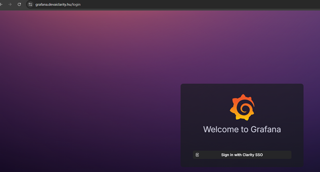

Felveszünk egy új adatforrást:

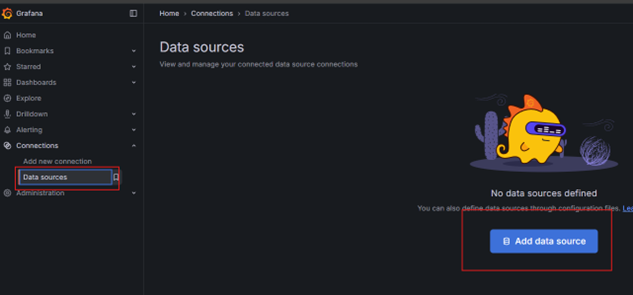

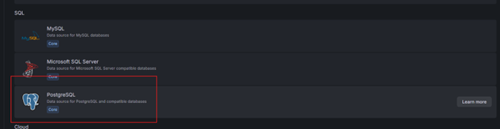

A jelszót a kdbx-ből -> litellm_db_password

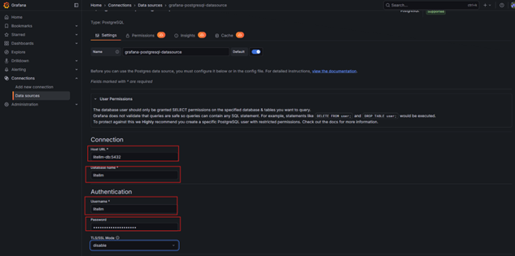

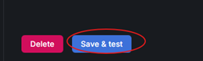

Ha minden rendben, akkor itt meg kell, hogy jelenjen a PostgreSQL:

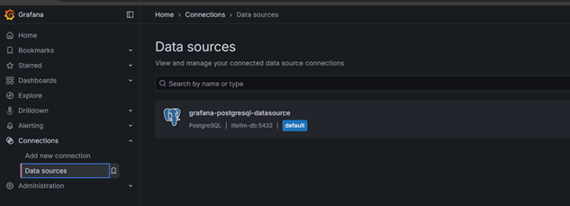

Létrehozunk egy új dashboard-ot

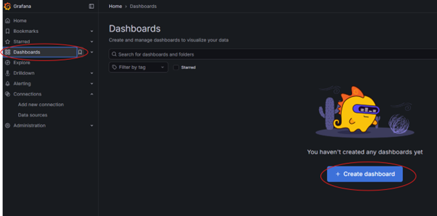

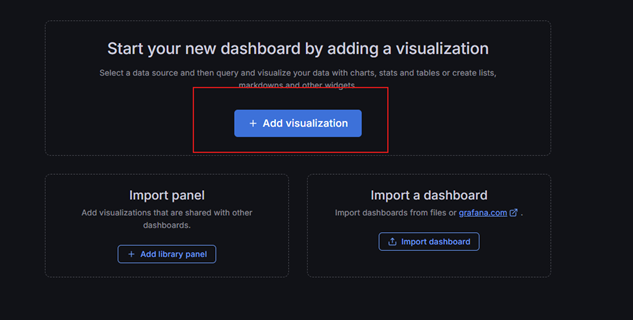

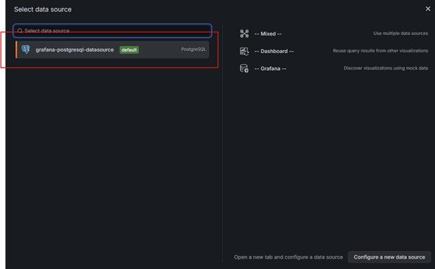

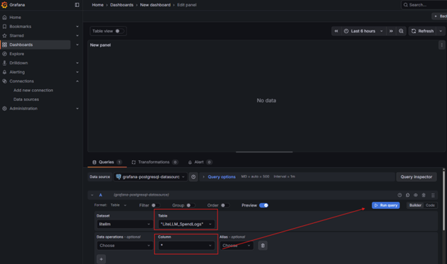

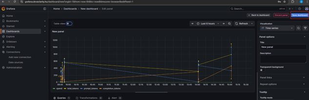

Mentjük az új dashboard-ot, a mentés többször fog felugorni, akkor mindig a mentésre menjünk.

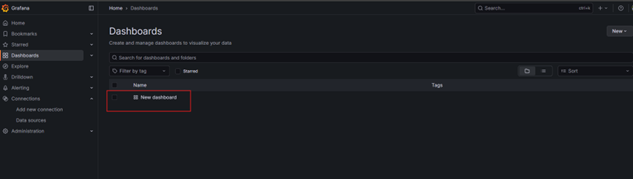

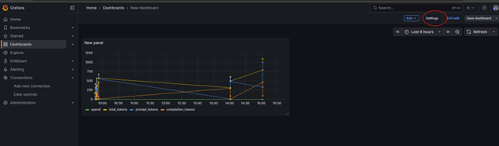

Az ID-t másoljuk ki:

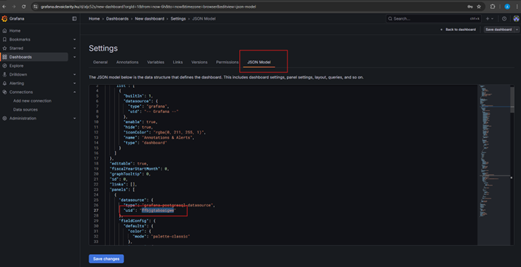

Ezután a GIT-es struktúrában keressük meg és nyissuk meg a fájlt:

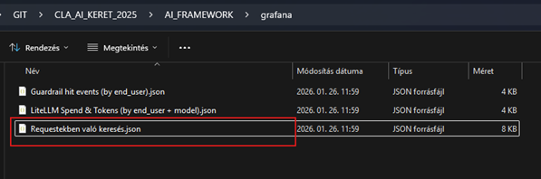

Az uid-t is cseréljük le mind a 3 json-ben:

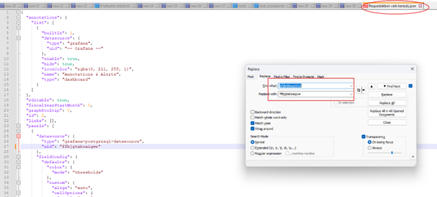

Ezután a Grafana felületén importáljuk:

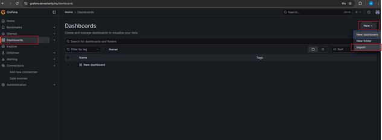

Tallózzuk a JSON fájlokat és importáljuk:

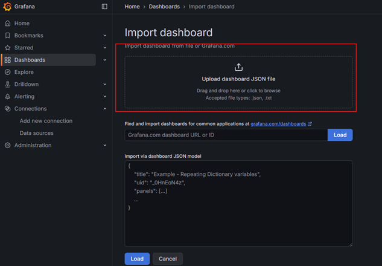

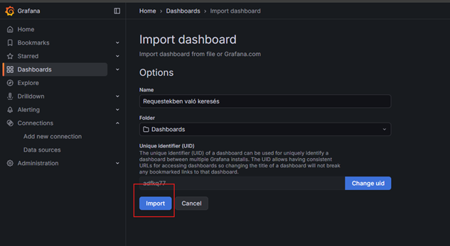

Így néz ki a beimportált riport:

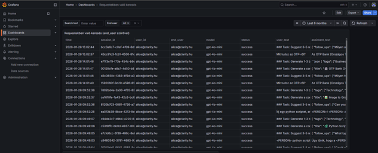


