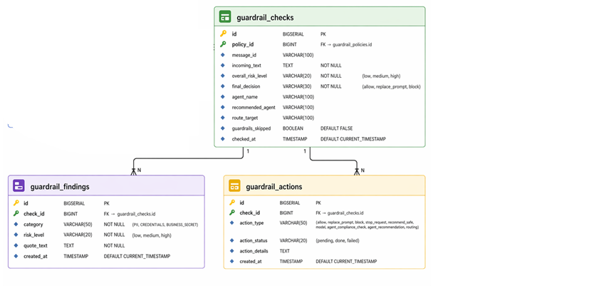
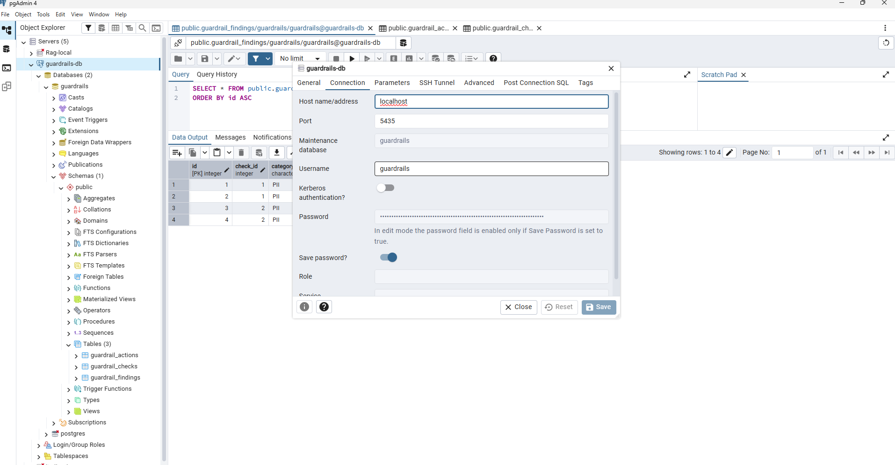

# Guardrails DB

## Cél

A guardrails-db egy dedikált PostgreSQL adatbázis, amely a Guardrails rendszer:

- audit logjait
- szabály- és policy eredményeket
- ellenőrzési eseményeket tárolja.

Ez biztosítja, hogy minden AI/LLM döntés visszakövethető legyen.

## Compose szerep

| Tulajdonság    | Érték              | Magyarázat                                      |
| -------------- | ------------------ | ----------------------------------------------- |
| Service név    | guardrails-db      | PostgreSQL audit DB service                     |
| Image          | postgres:16-alpine | Könnyű, production-ready PostgreSQL             |
| Konténer név   | guardrails-db      | fix név (debughoz jó, skálázásnál nem ajánlott) |
| Restart policy | unless-stopped     | automatikus újraindítás hiba esetén             |
| Hálózat        | llmnet             | belső Docker network                            |


## Függőségek

- `vault-agent`

## Portok

| Host port | Container port | Leírás                        |
| --------- | -------------- | ----------------------------- |
| 5435      | 5432           | Guardrails DB elérés kívülről |

## Környezeti változók

| Változó                | Jelentés                       |
| ---------------------- | ------------------------------ |
| TZ                     | időzóna                        |
| POSTGRES_USER          | adatbázis user (`guardrails`)  |
| POSTGRES_DB            | adatbázis neve                 |
| POSTGRES_PASSWORD_FILE | Vault-ból olvasott jelszó fájl |


## Volumes

| Volume                      | Cél                      | Típus | Leírás                          |
| --------------------------- | ------------------------ | ----- | ------------------------------- |
| guardrails_db_data          | /var/lib/postgresql/data | RW    | adatbázis persistencia          |
| ./guardrails/sql/tables.sql | init script              | RO    | inicializáló schema             |
| vault-secrets               | /secrets                 | RO    | Vault által injektált secret-ek |


## Init szkript

```bash
./guardrails/sql/tables.sql
```

Automatikusan lefut első indításkor:

- táblák létrehozása
- audit schema inicializálása
- indexek / constraints

⚠️ Csak akkor fut, ha a volume még üres!


## Litellm Compose

```bash
  guardrails-db:
    image: postgres:16-alpine
    container_name: guardrails-db
    restart: unless-stopped
    depends_on:
      - vault-agent
      
    environment:
      TZ: "${TZ:-Europe/Budapest}"
      POSTGRES_USER: guardrails
      POSTGRES_DB: guardrails
      POSTGRES_PASSWORD_FILE: /secrets/guardrails_db_secret

    volumes:
      - guardrails_db_data:/var/lib/postgresql/data
      - ./guardrails/sql/tables.sql:/docker-entrypoint-initdb.d/tables.sql:ro
      - vault-secrets:/secrets:ro
    ports:
      - "5435:5432"
    networks: [ llmnet ] 
```

### Secret kezelés

/secrets/guardrails_db_secret

## Tábla struktúra



### guardrail_checks

Egy konkrét bejövő üzenet guardrail ellenőrzésének eredményét tárolja.

| Mező neve          | Típus        | Kötelező | Leírás                                      |
| ------------------ | ------------ | -------- | ------------------------------------------- |
| id                 | BIGSERIAL    | igen     | Egyedi azonosító (Primary Key)              |
| policy_id          | BIGINT       | igen     | Hivatkozás a policy-re                      |
| message_id         | VARCHAR(100) | nem      | Külső rendszer üzenet azonosító             |
| incoming_text      | TEXT         | igen     | Bejövő üzenet                               |
| overall_risk_level | VARCHAR(20)  | igen     | Összesített kockázat (low, medium, high)    |
| final_decision     | VARCHAR(30)  | igen     | Végső döntés (allow, replace_prompt, block) |
| agent_name         | VARCHAR(100) | nem      | Eredeti agent                               |
| recommended_agent  | VARCHAR(100) | nem      | Ajánlott agent                              |
| route_target       | VARCHAR(100) | nem      | Routing cél                                 |
| guardrails_skipped | BOOLEAN      | igen     | Guardrail kihagyva (default: FALSE)         |
| checked_at         | TIMESTAMP    | igen     | Ellenőrzés ideje                            |

### guardrail_findings

Az ellenőrzés során talált érzékeny adatok tárolása.

| Mező neve  | Típus       | Kötelező | Leírás                                        |
| ---------- | ----------- | -------- | --------------------------------------------- |
| id         | BIGSERIAL   | igen     | Egyedi azonosító (Primary Key)                |
| check_id   | BIGINT      | igen     | Hivatkozás a guardrail check-re               |
| category   | VARCHAR(50) | igen     | Kategória (PII, CREDENTIALS, BUSINESS_SECRET) |
| risk_level | VARCHAR(20) | igen     | Kockázat (low, medium, high)                  |
| quote_text | TEXT        | igen     | Az érzékeny szövegrész                        |
| created_at | TIMESTAMP   | igen     | Létrehozás ideje                              |


### guardrail_actions

A guardrail döntés alapján végrehajtott akciók tárolása.

| Mező neve      | Típus       | Kötelező | Leírás                          |
| -------------- | ----------- | -------- | ------------------------------- |
| id             | BIGSERIAL   | igen     | Egyedi azonosító (Primary Key)  |
| check_id       | BIGINT      | igen     | Hivatkozás a guardrail check-re |
| action_type    | VARCHAR(50) | igen     | Akció típusa                    |
| action_status  | VARCHAR(20) | igen     | Állapot (pending, done, failed) |
| action_details | TEXT        | nem      | Részletes leírás                |
| created_at     | TIMESTAMP   | igen     | Létrehozás ideje                |

### Kapcsolati logika

- guardrail_checks.id → központi entity
- guardrail_findings.check_id → találatok egy check-hez
- guardrail_actions.check_id → akciók egy check-hez

### Adatbázis kapcsolat

