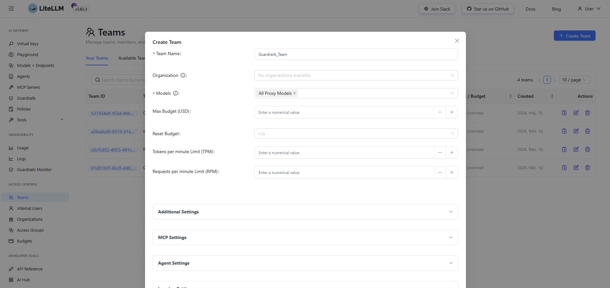
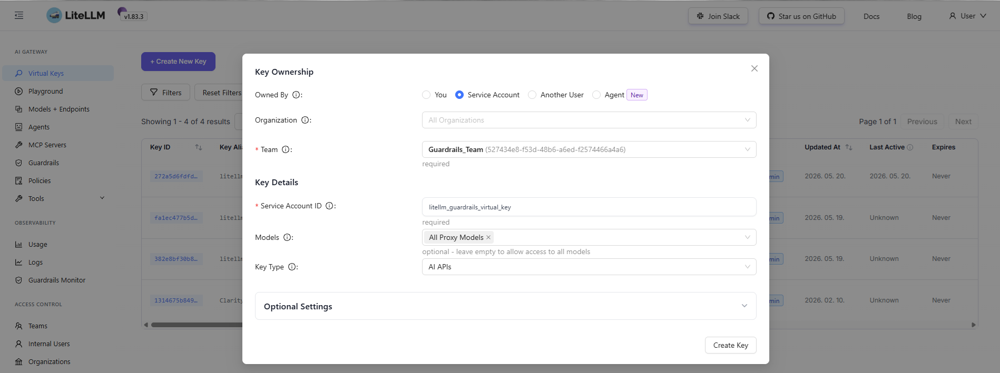

# Guardrails

## Cél

A guardrails szolgáltatás egy AI safety / policy enforcement réteg, amely:

- bejövő LLM üzeneteket ellenőriz
- PII / credential / sensitive data detektál
- döntést hoz (allow / block / replace)
- audit adatokat ment a guardrails-db-be

## Compose konfiguráció

| Tulajdonság    | Érték                                         | Leírás                     |
| -------------- | --------------------------------------------- | -------------------------- |
| Service név    | guardrails                                    | AI safety engine container |
| Image          | aiclarity.hu:8443/docker-ssl/guardrails:1.0.0 | privát registry image      |
| Konténer név   | guardrails                                    | fix runtime name           |
| Restart policy | unless-stopped                                | automatikus újraindítás    |
| Hálózat        | llmnet                                        | belső service mesh         |


## Függőségek

- `vault-agent`
- `litellm`
- `guardrails-db`

## Port mapping

| Host port | Container port | Leírás                  |
| --------- | -------------- | ----------------------- |
| 8100      | 8000           | Guardrails API endpoint |


## Volume mapping

| Path                  | Cél            | Típus | Funkció                   |
| --------------------- | -------------- | ----- | ------------------------- |
| ./guardrails/rails    | /app/rails     | RO    | policy rules (core logic) |
| server.py             | /app/server.py | RO    | API entry server          |
| guardrails_engine.py  | engine         | RO    | decision engine           |
| guardrails_config.yml | config         | RO    | system config             |
| ./guardrails/logs     | /app/logs      | RW    | runtime logs              |
| vault-secrets         | /secrets       | RO    | Vault credentials         |


## Környezeti változók

| Változó | Jelentés                          |
| ------- | --------------------------------- |
| TZ      | időzóna                           |
| DB_HOST | PostgreSQL host (`guardrails-db`) |
| DB_NAME | adatbázis neve                    |
| DB_USER | adatbázis user                    |

Ez felel:

- Vault secret-ek betöltéséért
- runtime config patch-elésért
- env override-ért

## Entry point (nagyon fontos)

```markdown
entrypoint: ["/bin/sh", "/app/guardrails.secrets-entrypoint.sh"]
```

## Docker Compose fájl

```markdown
  guardrails:
    image: aiclarity.hu:8443/docker-ssl/guardrails:1.0.0
    container_name: guardrails
    restart: unless-stopped
    environment:
      TZ: "${TZ:-Europe/Budapest}"      
      DB_HOST: guardrails-db
      DB_NAME: guardrails
      DB_USER: guardrails
    entrypoint: ["/bin/sh", "/app/guardrails.secrets-entrypoint.sh"]
    volumes:
      - ./guardrails/rails:/app/rails:ro
      - ./guardrails/server.py:/app/server.py:ro
      - ./guardrails/guardrails.secrets-entrypoint.sh:/app/guardrails.secrets-entrypoint.sh:ro
      - ./guardrails/logs:/app/logs  
      - ./guardrails/guardrails_engine.py:/app/guardrails_engine.py:ro
      - ./guardrails/guardrails_config.yml:/app/guardrails_config.yml:ro 
      - vault-secrets:/secrets:ro    
    ports:
      - "8100:8000"
    networks: [ llmnet ]
    depends_on:
      - litellm
      - vault-agent
      - guardrails-db
```	  

## Rendszer komponensek

### Policy layer

/app/rails -> szabály definíciók (regex, NLP, rules)

### Engine layer

guardrails_engine.py -> risk scoring + decision logic

### API layer

server.py -> REST endpoint LLM integrációhoz

## Guardrail és LiteLLM összekapcsolása

### LiteLLM teams és api_key létrehozása a Guardrails számára

Teams létrehozása:

- Név: Guardrails_Team
- Models: All Proxy Models



Virtual_key létrehozása:

- Team: Guardrails_Team
- Sevice Account ID: litellm_guardrails_virtual_key
- Models: All Proxy Models



### KEY_MAP módosítása

A KEY_MAP kulcshoz fel kell venni azt a kulcs nevet, amit szeretnénk felülírni

```markdown
  litellm-key-sync:
    # MANUAL TOOL:
    # docker compose -f docker-compose.yml -f docker-compose.patch.yml run --rm litellm-key-sync
    # python /app/rotate_delete_generate.py
    image: python:3.12-slim
    depends_on:
      - litellm
    networks: [ llmnet ]
    volumes:
      - ./litellm-key-sync:/app:rw
      - vault-secrets:/secrets:rw
    working_dir: /app
    environment:
      LITELLM_BASE_URL: "http://litellm:4000"
      LITELLM_ADMIN_KEY_FILE: /secrets/litellm_master_key
      KEY_MAP: "litellm_rag_gateway_virtual_key;litellm_pgvector_embed_service_virtual_key;litellm_guardrails_virtual_key"
      OUT_DIR: "/app/out"
      # DRY_RUN: "1"
    command: >
      sh -c "
        pip install --no-cache-dir -r requirements.txt &&
        echo '' &&
        echo '############################################' &&
        cat /app/usage.txt &&
        echo '############################################' &&
        sleep infinity
      "
```

### LiteLLM key felülírása

Cmd-ben ki kell adni az alábbi parancsot a megfelelő könyvtárból:

```markdown
docker compose -f docker-compose.yml -f docker-compose.patch.yml run --rm litellm-key-sync sh -c "pip install --no-cache-dir -r requirements.txt && python /app/rotate_delete_generate.py"
```


