# LiteLLM DB

## Cél

A `litellm-db` a LiteLLM saját Postgres adatbázisa.

## Compose szerep

- image: `postgres:16-alpine`
- container_name: `litellm-db`
- restart: `unless-stopped`

## Függőségek

- `vault-agent`

## Portok

- `5432:5432`

## Mountok

- `litellm-db:/var/lib/postgresql/data`
- `vault-secrets:/secrets:rw`

## Fejlesztői megjegyzések

- Közvetlenül használja:
  - `litellm`
  - `rag-gateway`
  - worker komponensek
- Később érdemes leírni a táblákat és a worker-ek adatmodelljét.

## Litellm Compose

```bash
  litellm-db:
    image: postgres:16-alpine
    container_name: litellm-db
    restart: unless-stopped
    depends_on:
      - vault-agent
    environment:
      TZ: "${TZ:-Europe/Budapest}"
      POSTGRES_USER: litellm
      POSTGRES_DB: litellm
      POSTGRES_PASSWORD_FILE: /secrets/litellm_db_password
    ports:
      - "5432:5432"
    logging:
      driver: syslog
      options:
        syslog-address: "udp://127.0.0.1:5514"
        syslog-format: "rfc3164"
        tag: "litellm_db"
    volumes:
      - litellm-db:/var/lib/postgresql/data
      - vault-secrets:/secrets:rw
    networks: [ llmnet ]
```

| Tulajdonság    | Érték              | Magyarázat                                                                                         |
| -------------- | ------------------ | -------------------------------------------------------------------------------------------------- |
| Service név    | litellm-db         | A Compose-on belüli logikai név, ezen érhető el más konténerekből (`litellm-db:5432`).             |
| Image          | postgres:16-alpine | PostgreSQL 16 könnyű (Alpine) verziója. Kis méret, gyors indulás, de néhány extra tool hiányozhat. |
| Konténer név   | litellm-db         | Fix név a könnyebb debughoz (`docker logs litellm-db`).                                            |
| Restart policy | unless-stopped     | Automatikusan újraindul hiba vagy Docker restart után.                                             |
| Hálózat        | llmnet             | Közös belső hálózat, ahol a LiteLLM és más service-ek elérik.                                      |


### Környezeti változók

- `POSTGRES_USER=litellm`
- `POSTGRES_DB=litellm`
- `POSTGRES_PASSWORD_FILE=/secrets/litellm_db_password`

| Változó                | Jelentés                                          |
| ---------------------- | ------------------------------------------------- |
| TZ                     | Időzóna (logok és DB timestamp miatt fontos)      |
| POSTGRES_USER          | Adatbázis felhasználó neve                        |
| POSTGRES_DB            | Létrehozott adatbázis neve                        |
| POSTGRES_PASSWORD_FILE | Jelszó fájlból (Vault-ból) → biztonságos megoldás |


### Secret kezelés

/secrets/litellm_db_password

### Volume-ok

| Volume        | Cél                      | Típus |
| ------------- | ------------------------ | ----- |
| litellm-db    | /var/lib/postgresql/data | RW    |
| vault-secrets | /secrets                 | RW    |


### Logging

| Beállítás | Érték                |
| --------- | -------------------- |
| Driver    | syslog               |
| Cím       | udp://127.0.0.1:5514 |
| Formátum  | rfc3164              |
| Tag       | litellm_db           |


## LiteLLM adatbázis csatlakozás

Előfeltétel, hogy PgAdmin vagy valamilyen adatbázis kezelő legyen telepítve.

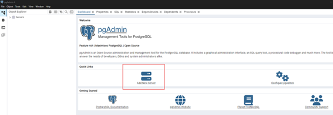

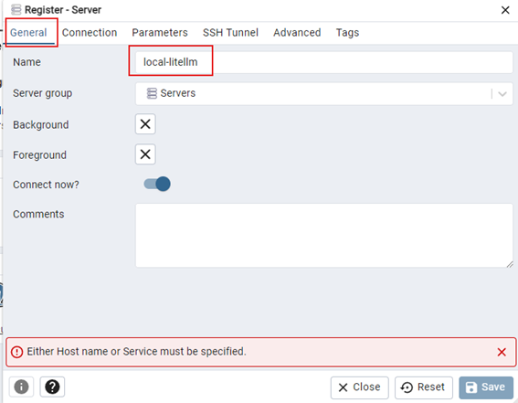

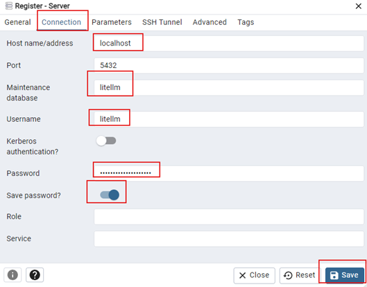

A jelszó a kdbx-ből - litellm_db_password

OpenWebUI DB csatlakozás:

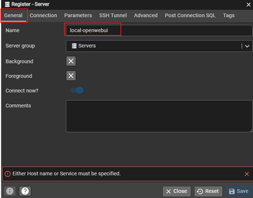

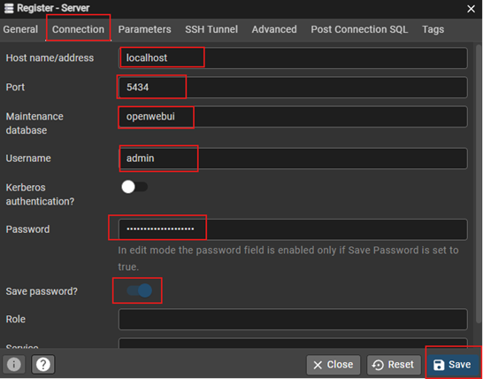

A jelszó a kdbx-ből - openwebui_db_password

## DB patch futtatás

Az AI_FRAMEWORK -ben a docker-compose.dbpatch.yml fájlt ha megnyitjuk, akkor az alábbiakat látjuk:

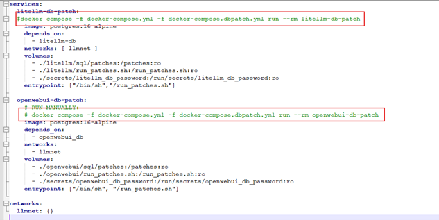

Nyitunk egy terminált és megfuttatjuk a két docker comose parancsot:

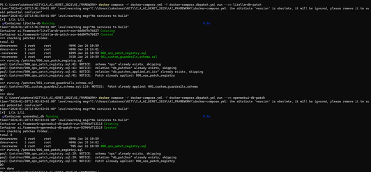

## Kivételek beállítása

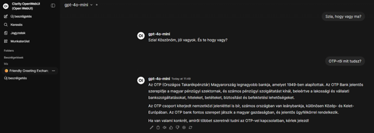

Az AI_FRAMEWORK\litellm\sql útvonalon van egy INSERT_custom_guardrails.blocklist.sql, amelyben van egy minta INSTERT, ebben tudjuk módosítani a kivételként kezelt értékeket, most az ’OTP’.

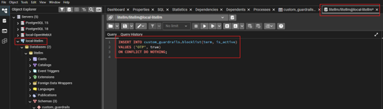

Bekerült a táblába:

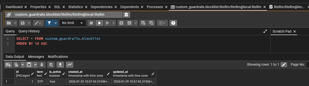

Miután beszúrtuk a táblába az ’OTP’ értéket, a modelünk nem válaszol a kérdésre.

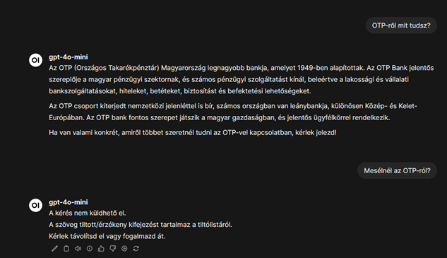


