# LiteLLM

## Cél

A `litellm` a modellekhez vezető központi gateway / proxy réteg.

## Compose szerep

- image: `ghcr.io/berriai/litellm:v1.81.0-stable`
- container_name: `litellm`
- restart: `unless-stopped`

## Függőségek

- `vault-agent`
- `valkey`
- `litellm-db`

## Fő konfiguráció

- config file: `/app/config.yaml`
- Redis backend: `redis://valkey:6379`
- Phoenix tracing endpoint: `http://phoenix:6006/v1/traces`
- auth mode: `proxy`

## Mountok

- `./litellm/config.yaml:/app/config.yaml:ro`
- `./litellm/custom_guardrail.py:/app/custom_guardrail.py:ro`
- `./litellm.secrets-entrypoint.sh:/entry/litellm.secrets-entrypoint.sh:ro`
- `vault-secrets:/secrets:ro`

## Kapcsolódó komponensek

- `litellm_oauth2_proxy`
- `api-gateway`
- `litellm-pgvector`
- `rag-ingest`
- `rag-gateway`

## Fejlesztői megjegyzések

- Ez a framework egyik központi komponense.
- Külön dokumentációt érdemel:
  - virtual key kezelés,
  - model routing,
  - guardrail integráció,
  - tracing.

## Docker Compose fájl

```markdown
  litellm:
    image: ghcr.io/berriai/litellm:v1.81.0-stable
    container_name: litellm
    restart: unless-stopped
    environment:
      TZ: "${TZ:-Europe/Budapest}"
      LITELLM_CONFIG: "/app/config.yaml"
      STORE_MODEL_IN_DB: false
      PORT: "4000"
      REDIS_URL: "redis://valkey:6379"
      LITELLM_LOG: "INFO"
      OPENAI_API_KEY: sk-local # FOR LM Studio server
      USE_PRISMA_MIGRATE: "false"
      PHOENIX_COLLECTOR_HTTP_ENDPOINT: "http://phoenix:6006/v1/traces"
      PHOENIX_PROJECT_NAME: "litellm"
      LITELLM_AUTH_MODE: proxy
    entrypoint: ["/bin/sh","/entry/litellm.secrets-entrypoint.sh"]
    logging:
      driver: syslog
      options:
        syslog-address: "udp://127.0.0.1:5514"
        syslog-format: "rfc3164"
        tag: "litellm"
    volumes:
      - ./litellm/config.yaml:/app/config.yaml:ro
      - ./litellm/custom_guardrail.py:/app/custom_guardrail.py:ro
      - ./litellm.secrets-entrypoint.sh:/entry/litellm.secrets-entrypoint.sh:ro
      - vault-secrets:/secrets:ro
    networks: [ llmnet ]
    depends_on:
      - vault-agent
      - valkey
      - litellm-db
      
  api-gateway:
    build: ./api-gateway
    container_name: api-gateway
    restart: unless-stopped
    networks: [ llmnet ]
    depends_on:
      - litellm
    environment:
      UPSTREAM: "http://litellm:4000"
      TIMEOUT_S: "120"
      TZ: "Europe/Budapest"
    logging:
      driver: syslog
      options:
        syslog-address: "udp://127.0.0.1:5514"
        syslog-format: "rfc3164"
        tag: "api-gateway"
    labels:
      - "traefik.enable=true"
      - "traefik.http.routers.api-gateway.rule=Host(`${API_GATEWAY_DOMAIN}`)"
      - "traefik.http.routers.api-gateway.entrypoints=websecure"
      - "traefik.http.routers.api-gateway.tls=true"
      - "traefik.http.services.api-gateway.loadbalancer.server.port=8080"
```	  

### LiteLLM + API Gateway

A rendszer központi AI proxy rétege:

- egységes API felület LLM-ekhez
- több modell (OpenAI, LM Studio, stb.) kezelése
- rate limit + auth + logging
- tracing (Phoenix)
- cache (Redis / Valkey)

A LiteLLM itt a core proxy engine.

### LiteLLM service

| Paraméter | Jelentés |
|----------|----------|
| image | LiteLLM proxy container (v1.81.0) |
| container_name | futó service neve |
| restart | automatikus újraindítás |
| PORT | 4000 → API port |
| TZ | időzóna beállítás |

### Konfigurációs logika

| Beállítás | Jelentés |
|----------|----------|
| LITELLM_CONFIG | fő config fájl (model routing, auth, policy) |
| STORE_MODEL_IN_DB | model meta adatok DB-ben tárolása (false = file-based) |
| LITELLM_AUTH_MODE | proxy auth mód (itt: proxy = saját auth layer) |

### Külső integrációk

| Integráció | Szerep |
|------------|-------|
| REDIS_URL (valkey) | cache + rate limit + session state |
| PHOENIX_COLLECTOR_HTTP_ENDPOINT | request tracing / observability |
| PHOENIX_PROJECT_NAME | tracing project név |
| OPENAI_API_KEY | fallback / LM Studio kompatibilitás |

### Security / entrypoint

entrypoint: /entry/litellm.secrets-entrypoint.sh

- Vault-ból betölti a secret-eket
- injektál API kulcsokat
- runtime config patch

### Volumes

| Volume | Funkció |
|--------|--------|
| config.yaml | model routing + policy |
| custom_guardrail.py | saját AI guardrail logika |
| vault-secrets | secret injection |

### Dependencies

- vault-agent → secret management
- valkey → Redis kompatibilis cache
- litellm-db → persistence (ha kell)

### API Gateway service

Ez egy reverse proxy réteg LiteLLM előtt:

- request kontroll
- timeout kezelés
- Traefik publikus API

### Konfiguráció

| Env | Jelentés |
|-----|--------|
| UPSTREAM | LiteLLM backend URL |
| TIMEOUT_S | request timeout |
| TZ | időzóna |

### Architektúra szerep

Client → API Gateway → LiteLLM → LLM modellek

### Build alapú service

build: ./api-gateway

### Traefik exposure

| Beállítás | Jelentés |
|----------|---------|
| Host rule | domain alapján elérés |
| entrypoints | HTTPS only |
| tls | titkosítás |
| port 8080 | container belső port |

## LITELLM ELÉRÉS

URL: {{litellm_url}}

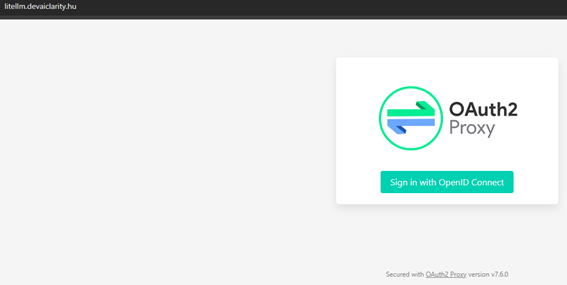

Itt a Sing in with OpenID Connection gombal megyünk tovább.

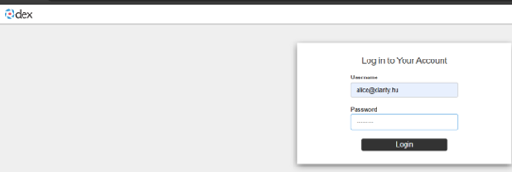

Az alice felhasználóval jelentkezünk be ismét.

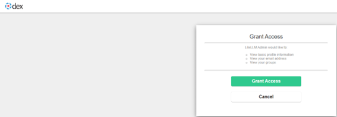

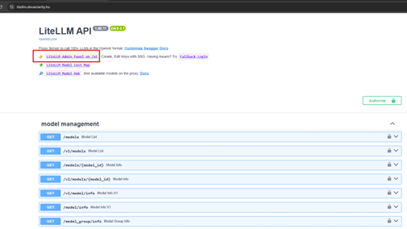

A „LiteLLM Admin Panel-en /ui„-t kell kiválasztani.
Az AI_FRAMEWORK\secrets mappában lesz egy litellm_master_key abból kell a jelszó.

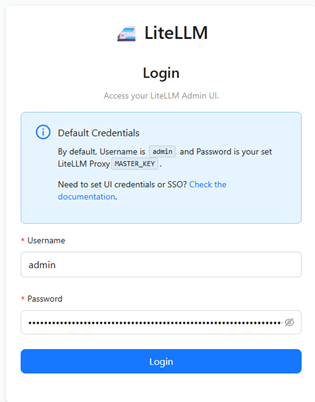

Ide érkezünk.
{{litellm_url_ui}}

Ha mintent jól csináltuk, akkor a következő felületet kell látunk:

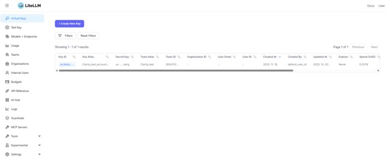

## LITELLM alap config

A Teams menüre lépve létrehozunk egy új team-et:

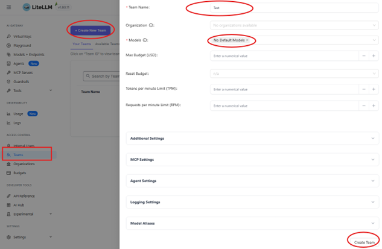

Miután létrehoztuk a Teamet, egyből módosítsjuk is:

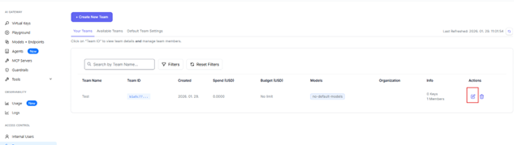

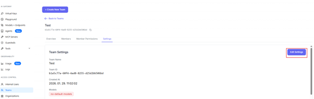

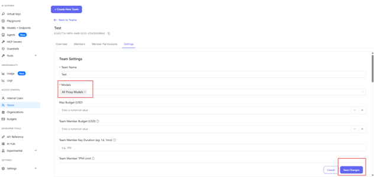

A Models lenyíló menüből az ALL Proxy Models opciót állítjuk be, ezt csak jelenleg így enged.
Következő lépésben a Virtual Keys menüben létrehozunk egy új kulcsot:

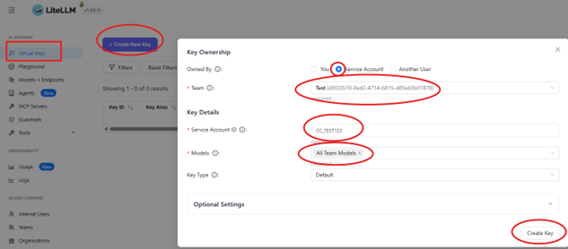

A Service Account ID az tetszőlegesen adhatunk bármit. A Create Key-re nyomva felugrik egy ablak, ott a kulcsot kimásoljuk.
Modell hozzáadása.

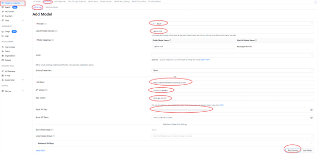

Provider: Azure
LiteLLM Model Name: azure/gpt-4o-mini
API base: https://ccazureopenaieastus.openai.azure.com
API version: 2025-01-01-preview
Base model: azure/gpt-4o-mini
Azure API Key:<<<Azure CC test>>> (Ezt a kdbx -ből kell)

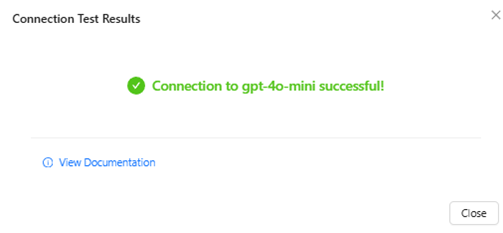

Ha sikeres volt a teszt, mentsük a modellt.

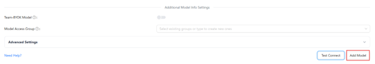

## LITELLM INTEGRÁCIÓ OPENWEBUI-BAN

A {{openwebui_url}} felületen a következő lépéseket kell végrehajtani:

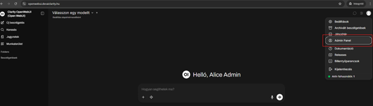

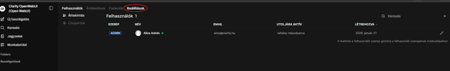

url: http://litellm:4000/v1
Model: gpt-4o-mini Miután beírtuk a model nevét a „+”-ra nyomjunk rá, hogy elmentse
A Barear sorban kell megadni a key-t, amit kimásoltunk a litellm-nél.

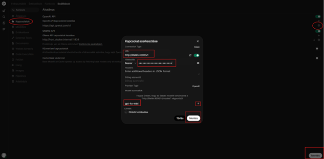

Ezek után látnunk kell a beállított modellt:

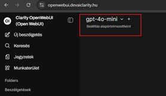

Ha mindent jól állítottunk be, akkor tudunk már beszélgetni vele, de a max_tokens alapértelmezetten 128-ra van állítva, ezt tudjuk feljebb rakni.

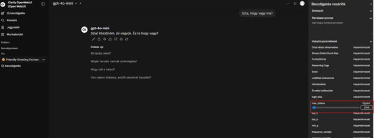

## LITELLM adatbázis kapcsolat

[LiteLLM-DB](../framework_components/litellm-db.md)