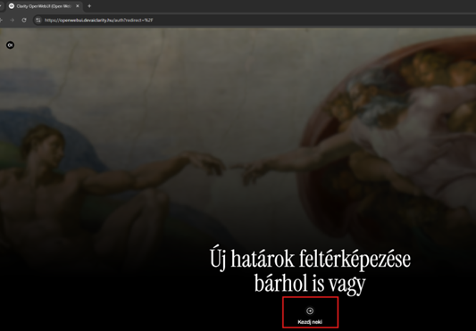
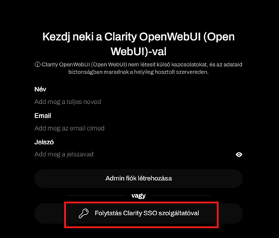
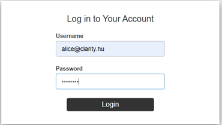
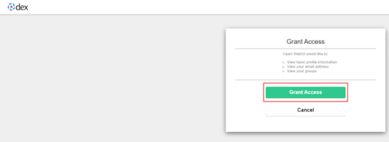
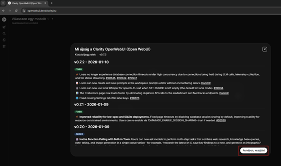

# OpenWebUI

## Cél
Az `openwebui` a rendszer fő felhasználói felülete, amely OIDC alapú hitelesítéssel, webkereséssel és LiteLLM integrációval működik.

## Compose szerep

- image: `ghcr.io/open-webui/open-webui:v0.7.2`
- container_name: `openwebui`
- restart: `unless-stopped`

## Függőségek

- `vault-agent`
- `openwebui_db`
- `dex`

## Portok

- `8080:8080`

## Routing

Traefik route:
- host: `${OPENWEBUI_DOMAIN}`
- target port: `8080`

## Fő funkciók a compose alapján

- OIDC / OAuth login Dexen keresztül
- web search SearXNG használatával
- role és group management
- custom branding / statikus UI fájlok mountolása

## Fontos mountok

- `openwebui-data:/app/backend/data`
- `./openwebui.secrets-entrypoint.sh:/entry/openwebui.secrets-entrypoint.sh:ro`
- `${ROOTCA}:/usr/local/share/ca-certificates/rootCA.crt:ro`
- több branding és static asset fájl az `./openwebui/style/` alól
- `vault-secrets:/secrets:ro`

## Kapcsolódó komponensek

- `openwebui_db`
- `dex`
- `searxng`

## Fejlesztői megjegyzések

- Ez az egyik legfontosabb kézi dokumentációs oldal lesz.
- Érdemes külön bontani:
  - auth / OIDC működés,
  - branding fájlok,
  - search integráció,
  - session és role kezelés.

## Docker Compose fájl

```markdown
  openwebui:
    image: ghcr.io/open-webui/open-webui:v0.7.2
    container_name: openwebui
    restart: unless-stopped
    depends_on:
      - vault-agent
      - openwebui_db
      - dex
    ports:
      - "8080:8080"
    environment:
      TZ: "${TZ:-Europe/Budapest}"
      WEBUI_NAME: "${OPENWEBUI_NAME:-OpenWebUI}"
      GLOBAL_LOG_LEVEL: INFO
      OPENAI_LOG_LEVEL: INFO
      MAIN_LOG_LEVEL: INFO
      MODELS_LOG_LEVEL: INFO     
      JWT_EXPIRES_IN: "${SESSION_EXPIRE}"    

      ENABLE_LDAP: "false"
      ENABLE_OAUTH_PERSISTENT_CONFIG: "false"
      ENABLE_OAUTH_SIGNUP: "true"
      ENABLE_SIGNUP: "false"          
      ENABLE_PASSWORD_AUTH: "false"
      ENABLE_LOGIN_FORM: "false" 
      OAUTH_MERGE_ACCOUNTS_BY_EMAIL: "true"
      OAUTH_PROVIDER_NAME: "${SSO_PROVIDER_NAME:-Comp SSO}"
      OPENID_PROVIDER_URL: "http://dex:5556/dex/.well-known/openid-configuration"
      OAUTH_CLIENT_ID: "${OPENWEBUI_OAUTH_CLIENT_ID:-openwebui}"
      OAUTH_SCOPES: "openid email profile groups"
      OPENID_REDIRECT_URI: "${OPENWEBUI_OIDC_REDIRECT_URI}"
      ENABLE_OAUTH_ROLE_MANAGEMENT: "true"
      OAUTH_ROLES_CLAIM: "${OPENWEBUI_ROLES_CLAIM:-groups}"
      OAUTH_ADMIN_ROLES: "${OPENWEBUI_ADMIN_ROLES:-llm-admins}"
      OAUTH_ALLOWED_ROLES: "${OPENWEBUI_ALLOWED_ROLES:-ai-basic,ai-advanced,llm-admins}"
      ENABLE_OAUTH_GROUP_MANAGEMENT: "true"
      OAUTH_GROUP_CLAIM: "${OPENWEBUI_GROUP_CLAIM:-groups}"
      ENABLE_OAUTH_GROUP_CREATION: "true"
      ENABLE_FORWARD_USER_INFO_HEADERS: "true"

      ENABLE_WEB_SEARCH: "true"
      WEB_SEARCH_ENGINE: "searxng"
      SEARXNG_QUERY_URL: "http://searxng:8080/search?q=<query>&format=json"
      SEARXNG_LANGUAGE: "hu-HU"
      
      SSL_CERT_FILE: /etc/ssl/certs/ca-certificates.crt
      REQUESTS_CA_BUNDLE: /etc/ssl/certs/ca-certificates.crt
      
    entrypoint: ["/bin/sh","/entry/openwebui.secrets-entrypoint.sh"]
    command: ["bash","start.sh"]
    logging:
      driver: syslog
      options:
        syslog-address: "udp://127.0.0.1:5514"
        syslog-format: "rfc3164"
        tag: "openwebui"
    volumes:
      - openwebui-data:/app/backend/data
      - ./openwebui.secrets-entrypoint.sh:/entry/openwebui.secrets-entrypoint.sh:ro
      - ${ROOTCA}:/usr/local/share/ca-certificates/rootCA.crt:ro
      - ./openwebui/style/custom.css:/app/build/static/custom.css
      - ./openwebui/style/custom.js:/app/build/static/custom.js
      - ./openwebui/style/index.html:/app/build/index.html
      - ./openwebui/style/model-map.json:/app/backend/open_webui/static/model-map.json
      - ./openwebui/style/favicon.svg:/app/build/static/favicon.svg
      - ./openwebui/style/favicon-96x96.png:/app/build/static/favicon-96x96.png
      - ./openwebui/style/splash.png:/app/build/static/splash.png
      - ./openwebui/style/logo.png:/app/build/static/logo.png
      - ./openwebui/style/favicon.png:/app/build/static/favicon.png
      - ./openwebui/style/favicon-dark.png:/app/build/static/favicon-dark.png
      - ./openwebui/style/splash-dark.png:/app/build/static/splash-dark.png
      - ./openwebui/style/favicon.ico:/app/build/static/favicon.ico
      - vault-secrets:/secrets:ro
    networks: [ llmnet ]
    labels:
      - "traefik.enable=true"
      - "traefik.http.routers.openwebui.rule=Host(`${OPENWEBUI_DOMAIN}`)"
      - "traefik.http.routers.openwebui.entrypoints=websecure"
      - "traefik.http.routers.openwebui.tls=true"
      - "traefik.http.services.openwebui.loadbalancer.server.port=8080"
    extra_hosts:
      - "${SSO_DOMAIN}:host-gateway" 
```

## Alap adatok

| Tulajdonság        | Érték                          |
|--------------------|--------------------------------|
| Service név        | openwebui                      |
| Image              | ghcr.io/open-webui/open-webui:v0.7.2 |
| Konténer név       | openwebui                      |
| Port               | 8080                           |
| Hálózat            | llmnet                         |

## Auth / SSO konfiguráció

| Változó | Jelentés |
|--------|----------|
| ENABLE_OAUTH_SIGNUP | Meghatározza, hogy az OAuth (SSO) login során automatikusan létrejöhet-e új felhasználó. Ha `true`, akkor a Dex-ből érkező user első belépéskor regisztrálódik. |
| ENABLE_LOGIN_FORM | A klasszikus felhasználónév/jelszó login form megjelenítése. `false` esetén kizárólag SSO használható. |
| ENABLE_PASSWORD_AUTH | Lokális jelszavas autentikáció engedélyezése. SSO-only rendszerben ezt érdemes kikapcsolni. |
| OAUTH_PROVIDER_NAME | Az SSO szolgáltató neve, ami a login UI-ban jelenik meg (pl. "Comp SSO"). |
| OPENID_PROVIDER_URL | Az OpenID Connect konfiguráció URL-je (Dex `.well-known` endpoint). Innen tölti le a kliens az auth endpointokat. |
| OAUTH_CLIENT_ID | Az OpenWebUI kliens azonosítója a Dex-ben. Ennek egyeznie kell a Dex konfigurációval. |
| OPENID_REDIRECT_URI | Az a callback URL, ahova login után visszatér a felhasználó. Kritikus, hogy egyezzen a Dex-ben regisztrált URI-val. |
| OAUTH_SCOPES | Az igényelt OIDC scope-ok. `openid` kötelező, az `email`, `profile`, `groups` extra user adatokat ad vissza. |

## Role / Group kezelés

| Változó | Jelentés |
|--------|----------|
| ENABLE_OAUTH_ROLE_MANAGEMENT | Engedélyezi, hogy az alkalmazás a tokenben kapott role-ok alapján kezelje a jogosultságokat. |
| OAUTH_ROLES_CLAIM | Az a JWT mező (claim), amely tartalmazza a role-okat (pl. `groups`). |
| OAUTH_ADMIN_ROLES | Azok a role-ok, amelyek admin jogosultságot adnak az OpenWebUI-ban. |
| OAUTH_ALLOWED_ROLES | Csak ezekkel a role-okkal rendelkező felhasználók léphetnek be. Ez egy whitelist. |
| ENABLE_OAUTH_GROUP_MANAGEMENT | A csoportok automatikus szinkronizálása az IdP-ből (Dex/LDAP). |
| OAUTH_GROUP_CLAIM | Az a claim, amely a csoportokat tartalmazza (általában ugyanaz, mint roles). |
| ENABLE_OAUTH_GROUP_CREATION | Ha `true`, akkor a rendszer automatikusan létrehozza a hiányzó csoportokat login során. |

## Web search

| Változó | Jelentés |
|--------|----------|
| ENABLE_WEB_SEARCH | Engedélyezi, hogy a chatbot külső webes keresést használjon válaszadáskor. |
| WEB_SEARCH_ENGINE | A kereső backend típusa (pl. `searxng`, ami self-hosted meta search engine). |
| SEARXNG_QUERY_URL | A keresési API endpoint. A `<query>` placeholder helyére kerül a keresőkifejezés. |
| SEARXNG_LANGUAGE | A keresés nyelve/lokalizációja (pl. `hu-HU`). |

## Volume-ok

| Volume | Jelentés |
|-------|---------|
| openwebui-data | Az alkalmazás adatainak (pl. beszélgetések, user beállítások) perzisztens tárolása. |
| custom.css/js/html | UI testreszabás (branding, egyedi script-ek, kinézet módosítása). |
| model-map.json | Modellek konfigurációja / mapping (pl. mely LLM-ek érhetők el). |
| vault-secrets | Vault által biztosított secret-ek (pl. API kulcsok). |

## Traefik konfiguráció

| Beállítás | Jelentés |
|----------|---------|
| traefik.enable | Engedélyezi, hogy a Traefik reverse proxy kezelje ezt a service-t. |
| routers.rule | Domain alapú routing szabály (Host header alapján). |
| entrypoints | Melyik Traefik entrypointon érhető el (pl. `websecure` = HTTPS). |
| tls | Titkosított (HTTPS) kapcsolat használata. |
| loadbalancer.server.port | A konténeren belüli port, amit a Traefik elér. |


## BELÉPÉS A OPENWEBUI.DEVAICLARITY-RA

Ha a böngészőbe beírjuk, hogy openwebui.devaiclarity.hu, akkor a következő felületre érkezünk(fut a dockerben az ai_framework image).



Kezdj neki feliratra kattintunk, majd ez a felület érkezik:



Itt a Folytatás Clarity SSO szolgáltatóval megyünk tovább. Majd belépünk az alice felhasználóval.



Sikeres belépés után a dex felületén az alábbi ablaknak kel megjelennie és itt a Grant Access-el megyünk tovább.



