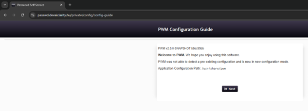
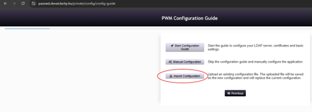
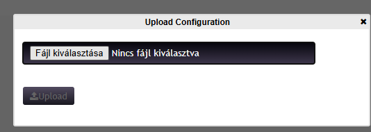
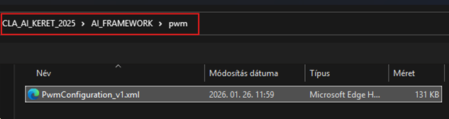
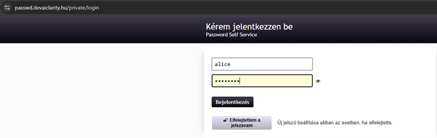
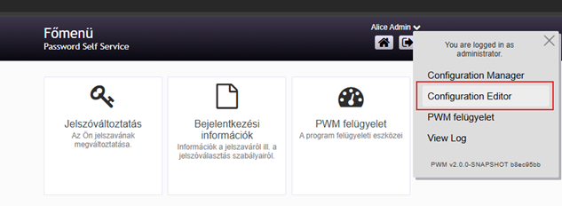
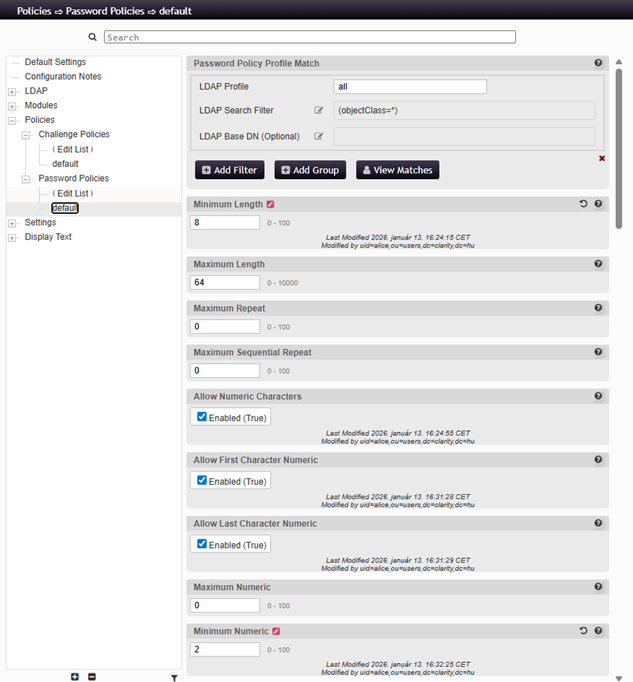

# PWM

## Cél

A `pwm` jelszókezelési / jelszóreset felületként működik.

## Compose szerep

- image: `fjudith/pwm:latest`
- container_name: `pwm`
- restart: `unless-stopped`

## Routing

Traefik route:
- host: `${PASSWD_DOMAIN}`
- target port: `8080`

## Mountok

- `pwm-data:/usr/share/pwm`

## Környezeti változók

- `TZ`
- `PWM_APPLICATIONFLAGS=NoFileLock`

## Fejlesztői megjegyzések

- Külön érdemes leírni:
  - LDAP kapcsolódást,
  - felhasználói reset folyamatot,
  - esetleges kezdeti konfigurációs lépéseket.
  
## PWM compose

```bash
  pwm:
    image: fjudith/pwm:latest
    container_name: pwm
    restart: unless-stopped
    networks: [ llmnet ]
    environment:
      - TZ=${TZ:-Europe/Budapest}
      - PWM_APPLICATIONFLAGS=NoFileLock
    volumes:
      - pwm-data:/usr/share/pwm
    labels:
      - "traefik.enable=true"
      - "traefik.http.routers.pwm.rule=Host(`${PASSWD_DOMAIN}`)"
      - "traefik.http.routers.pwm.entrypoints=websecure"
      - "traefik.http.routers.pwm.tls=true"
      - "traefik.http.services.pwm.loadbalancer.server.port=8080"
```	  

| Tulajdonság    | Érték              | Magyarázat                                                                                                                                                                                                                         |
| -------------- | ------------------ | ---------------------------------------------------------------------------------------------------------------------------------------------------------------------------------------------------------------------------------- |
| Service név    | pwm                | A Docker Compose-ban használt logikai név. Ezen a néven érhető el a service a hálózaton belül (pl. más konténerek innen hívják: `http://pwm:8080`).                                                                                |
| Image          | fjudith/pwm:latest | A használt Docker image, amely tartalmazza a **PWM** alkalmazást. A `latest` tag mindig a legfrissebb verziót húzza, ami fejlesztésnél kényelmes, de production-ben érdemes verzióhoz kötni.                                       |
| Konténer név   | pwm                | A futó konténer konkrét neve a Dockerben. Ez megkönnyíti a debugolást (`docker logs pwm`, `docker exec -it pwm bash`). Ha nincs megadva, Docker automatikusan generálna egy nevet.                                                 |
| Restart policy | unless-stopped     | Meghatározza, hogy a konténer újrainduljon-e hiba vagy Docker restart után. Az `unless-stopped` azt jelenti: mindig újraindul, kivéve ha manuálisan leállítottad. Ez fontos egy ilyen kritikus szolgáltatásnál (pl. jelszó reset). |
| Hálózat        | llmnet             | Az a közös Docker hálózat, ahol a service fut. Ez biztosítja, hogy más komponensek (pl. OpenLDAP, Traefik) elérjék egymást név alapján. Ez egy belső kommunikációs réteg az egész platformban.                                     |


### Környezeti változók

| Változó              | Jelentés                                                                                       |
| -------------------- | ---------------------------------------------------------------------------------------------- |
| TZ                   | Időzóna (alap: Europe/Budapest)                                                                |
| PWM_APPLICATIONFLAGS | Speciális PWM flag-ek (pl. `NoFileLock` → fájl lock kikapcsolása, Docker kompatibilitás miatt) |

Volume-ok

| Volume   | Cél            | Típus |
| -------- | -------------- | ----- |
| pwm-data | /usr/share/pwm | RW    |


### Traefik publikálás

| Beállítás      | Jelentés                              |
| -------------- | ------------------------------------- |
| traefik.enable | service publikálása                   |
| router rule    | domain alapú elérés (`PASSWD_DOMAIN`) |
| entrypoints    | HTTPS (websecure)                     |
| tls            | titkosított kapcsolat                 |
| service port   | 8080 (belső PWM port)                 |


### Architektúra szerep

User → Traefik → PWM → LDAP

### Kapcsolatok

| Kapcsolat       | Szerep                        |
| --------------- | ----------------------------- |
| LDAP (OpenLDAP) | user adatok és jelszó kezelés |
| Traefik         | publikus elérés               |
| llmnet          | belső kommunikáció            |

##	PASSWORD ADMIN FELÜLET

URL: {{passwd_url}}









Ezután bejelentkezünk:





Ide a kdbx fájlban van a jelszó - pwm admin

Majd a felületen ezt kell látnunk:



