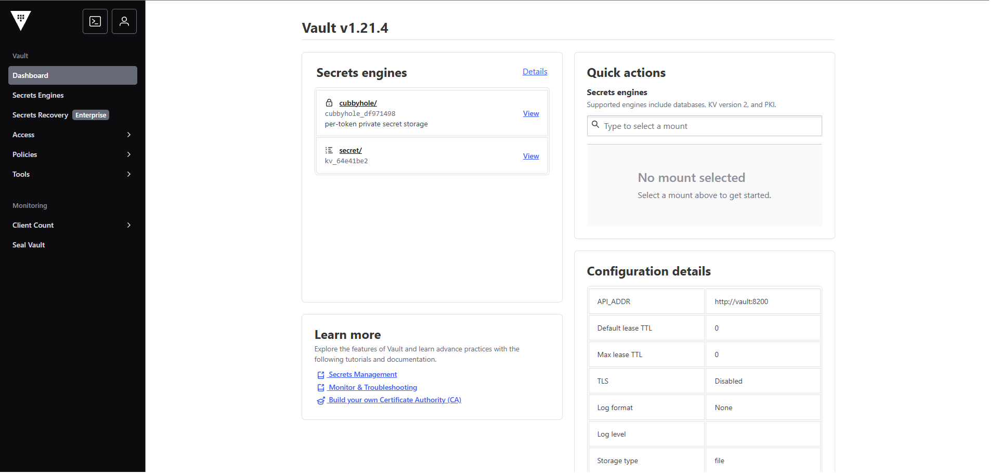
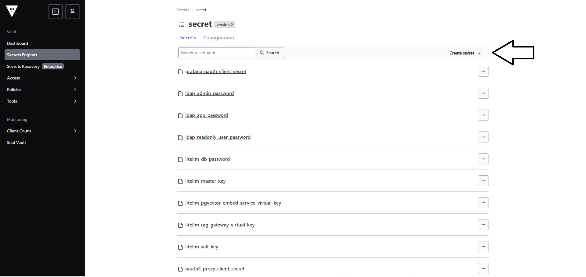
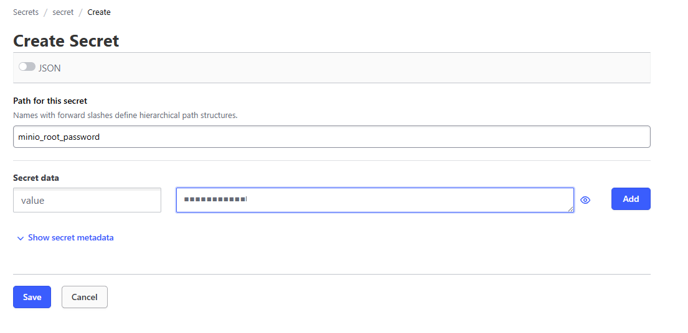

# Vault Agent

## Cél

A `vault-agent` feladata a Vaultból származó titkok előkészítése és a megosztott `vault-secrets` volume feltöltése a többi komponens számára.

## Compose szerep

- image: `hashicorp/vault:latest`
- container_name: `vault-agent`
- restart policy: `no`
- fix IP: `172.19.0.42` a `llmnet` hálózaton
- `IPC_LOCK` capability engedélyezve

## Fő konfiguráció

### Environment
- `VAULT_ADDR=http://vault:8200`

### Mountok
- `./vault-agent/templates:/etc/vault-agent/templates:ro`
- `./vault-agent/vault-agent.hcl:/etc/vault-agent/config.hcl:ro`
- `./vault-agent/role_id:/vault/config/role_id:ro`
- `vault-secrets:/secrets:rw`

### Parancs
A service induláskor létrehozza a `/secrets` mappát, írhatóvá teszi, majd elindítja a Vault Agentet a megadott HCL konfigurációval.

## Kapcsolódó komponensek

A `vault-secrets` volume-on keresztül több komponens is erre támaszkodik, például:
- `openwebui_db`
- `dex`
- `openwebui`
- `openldap`
- `litellm_oauth2_proxy`
- `litellm-db`
- `litellm`
- `rag-db`
- `rag-ingest`
- `rag-gateway`
- `grafana`
- worker komponensek


### Vault-Agent compose
```bash
  # ---------------- Vault Agent ----------------
  vault-agent:
    image: hashicorp/vault:latest
    container_name: vault-agent
    restart: "no"
    cap_add:
      - IPC_LOCK
    user: "0"
    environment:
      VAULT_ADDR: "http://vault:8200"
    volumes:
      - ./vault-agent/templates:/etc/vault-agent/templates:ro
      - ./vault-agent/vault-agent.hcl:/etc/vault-agent/config.hcl:ro
      - ./vault-agent/role_id:/vault/config/role_id:ro
      - vault-secrets:/secrets:rw
    #command: vault agent -config=/etc/vault-agent/config.hcl
    command: >
      sh -lc "mkdir -p /secrets &&
         chmod 777 /secrets &&
         vault agent -config=/etc/vault-agent/config.hcl"    
    networks:
      llmnet:
        ipv4_address: 172.19.0.42
``` 

| Elem                            | Jelentés                                                                     |
| :------------------------------ | :--------------------------------------------------------------------------- |
| `vault-agent:`                  | A Vault Agent szolgáltatás neve (a HashiCorp Vault kliens oldali komponense) |
| `image: hashicorp/vault:latest` | Ugyanazt az image-et használja, mint a Vault szerver                         |
| `container_name: vault-agent`   | Fix konténernév                                                              |
| `restart: "no"`                 | Nem indul újra automatikusan (tipikusan init / egyszeri futás)               |
| `cap_add: IPC_LOCK`             | Memória lock, hogy a titkok ne kerüljenek swap-be                            |
| `user: "0"`                     | Root userként fut (jogosultságok miatt szükséges lehet)                      |
| `environment: VAULT_ADDR`       | Vault szerver belső címe (`http://vault:8200`)                               |
| `templates` volume              | Template fájlok (pl. secret rendereléshez)                                   |
| `vault-agent.hcl`               | A Vault Agent konfiguráció                                                   |
| `role_id`                       | AppRole autentikációhoz szükséges azonosító                                  |
| `vault-secrets:/secrets`        | Shared volume, ide írja ki a generált secret-eket                            |
| `command (commentelt)`          | Alap Vault Agent indítás (egyszerűbb verzió)                                 |
| `command (sh -lc ...)`          | Indítás előtti setup + agent futtatás                                        |
| `mkdir -p /secrets`             | Secrets mappa létrehozása                                                    |
| `chmod 777 /secrets`            | Mindenki számára írható (egyszerű, de nem biztonságos)                       |
| `vault agent -config=...`       | Vault Agent indítása konfigurációval                                         |
| `networks: llmnet`              | Csatlakozás a közös Docker hálózathoz                                        |
| `ipv4_address: 172.19.0.42`     | Fix IP cím a konténernek (statikus címzés)                                   |

| Lépés | Leírás                                       |
| :---- | :------------------------------------------- |
| 1     | Vault Agent elindul                          |
| 2     | AppRole segítségével autentikál a Vault felé |
| 3     | Lekéri a szükséges secret-eket               |
| 4     | Template alapján fájlokba írja (`/secrets`)  |
| 5     | Más konténerek ezt a volume-ot használhatják |

###Volume konfiguráció (vault-secrets)

A fő compose fájlban hozunk létre egy megosztott volume-ot.

```bash
volumes:
  vault-secrets:
    driver: local
    driver_opts:
      type: tmpfs
      device: tmpfs
      o: size=64m,uid=1000
``` 

| Elem                   | Jelentés                                                          |
| :--------------------- | :---------------------------------------------------------------- |
| `vault-secrets:`       | Egy Docker volume neve, amelyet a konténerek megosztva használnak |
| `driver: local`        | A Docker alapértelmezett (lokális) volume driver-e                |
| `driver_opts:`         | Speciális beállítások a volume működéséhez                        |
| `type: tmpfs`          | A volume típusa memória-alapú (RAM-ban tárolódik, nem diszken)    |
| `device: tmpfs`        | A használt eszköz típusa szintén tmpfs (memória filesystem)       |
| `o: size=64m,uid=1000` | Opciók: max 64 MB méret, a fájlok tulajdonosa UID 1000            |

###Vault-agent használata

| Lépés | Leírás                                        |
| :---- | :-------------------------------------------- |
| 1     | Vault Agent lekéri a secret-eket              |
| 2     | Beleírja a `vault-secrets` volume-ba          |
| 3     | Más konténerek innen olvassák                 |
| 4     | Konténer restart → secret-ek újragenerálódnak |

###Vault-cleanup használata

```bash
  # ---------------- vault-cleanup ----------------  
  vault-cleanup:
    image: busybox
    depends_on:
      - vault-agent
    volumes:
      - vault-secrets:/secrets:rw
    command: sh -c "sleep 1800 && rm -rf /secrets/*"
    restart: "no"   
``` 

> 🧹 **Cleaner kikapcsolása fejlesztésnél**  
>  
> Miután elindul a konténer és kiolvasásra kerülnek a secretek, lefut egy cleaner,  
> ami törli a `vault-secrets` volume tartalmát.  
>  
> Fejlesztésnél ez a viselkedés kikapcsolható.

| Elem                                               | Jelentés                                                                   |
| :------------------------------------------------- | :------------------------------------------------------------------------- |
| `vault-cleanup:`                                   | Karbantartó konténer, amely törli a Vault Agent által generált secret-eket |
| `image: busybox`                                   | Minimalista Linux image (alap shell + alap parancsok)                      |
| `depends_on: vault-agent`                          | Csak a Vault Agent elindulása után indul                                   |
| `vault-secrets:/secrets`                           | A shared tmpfs volume csatlakoztatása (secret-ek helye)                    |
| `command: sh -c "sleep 180 && rm -rf /secrets/*"`  | 3 perc várakozás után törli a /secrets tartalmát                           |
| `sleep 1800`                                       | 180 másodperc = 3   perc késleltetés                                       |
| `rm -rf /secrets/*`                                | Minden secret fájl törlése                                                 |
| `restart: "no"`                                    | Nem indul újra automatikusan                                               |


## Új secret felvétele

### .hosts fájlba fel kell venni
Ha lokálisan használjuk: 172.28.10.13 vault.devaiclarity.hu
Ha dev szerveren használjuk: 127.0.0.1 vault.devaiclarity.hu

### A vault-ban rögzíteni kell az új secret-et
 Az admin felület elérhető az alábbi linken:
```bash
 https://vault.devaiclarity.hu:8444/
``` 


### Új secret rögzítése


- Path for the secret -> kulcs neve
- Secret data -> value-t kell megadni kulcsnak és mellé a jelszót



### Template fájl létrehozása

pl: létrehozzuk az uj_secret.ctmpl fájl-t 

Tartalma:
```bash

{{- with secret "secret/data/<<ide kell a secret név>>_key" -}}
{{ .Data.data.value }}
{{- end }}

```

### vault-agent.hcl
vault-agent.hcl fájlba be kell jegyezni az új template-et, amit az új secret kiolvasására készítettünk.

```bash
template {
  source      = "/etc/vault-agent/templates/<<uj_secret>>.ctmpl"
  destination = "/secrets/<<ilyen néven lehet majd rá hivatkozni a konténerben>>"
}
```

## Fejlesztői megjegyzések

- Ez a service a titokkezelési lánc eleje.
- A környezet fejlesztői dokumentációjában külön érdemes leírni a Vault bootstrap és AppRole folyamatot.
- A kapcsolódó fájlok:
  - `vault-agent/vault-agent.hcl`
  - `vault-agent/templates/*`
  - `vault-agent/role_id`
