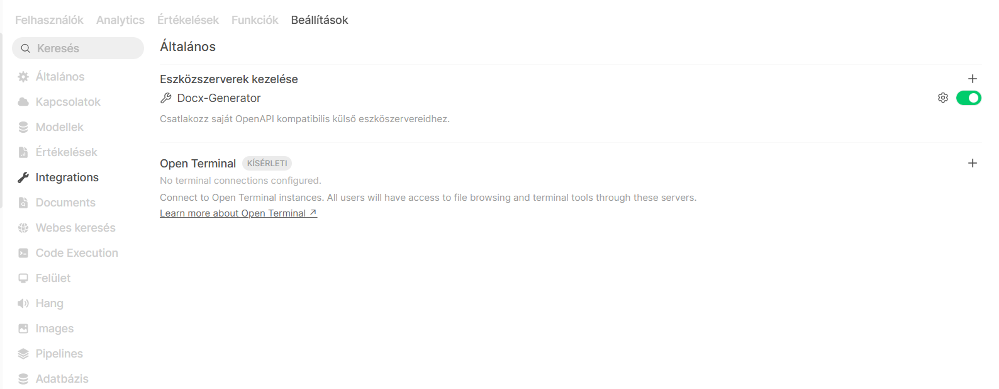
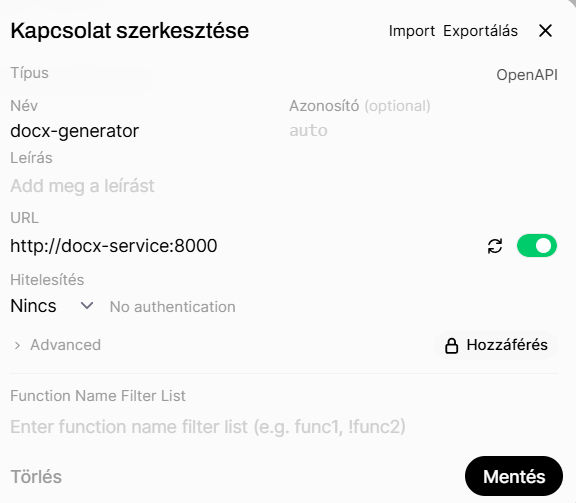

# DOCX generáló szolgáltatás integrálása OpenWebUI-ban

Az OpenWebUI lehetőséget biztosít külső OpenAPI kompatibilis szolgáltatások integrálására. 

## Előfeltételek

A DOCX generáló szolgáltatásnak futnia kell és elérhetőnek kell lennie az OpenWebUI számára.


## Kapcsolat létrehozása

Navigálj ide:

**Beállítások → Integrations**

Az **Eszközszerverek kezelése** szakaszban kattints a **+** ikonra.



## OpenAPI kapcsolat konfigurálása

A megjelenő ablakban töltsd ki az alábbi mezőket:

### Típus

```text
OpenAPI
```

### Név

```text
docx-generator
```

### URL

```text
http://docx-service:8000
```

### Hitelesítés

```text
Nincs (No authentication)
```

Amennyiben a szolgáltatás hitelesítést igényel, itt adhatók meg a szükséges adatok.



## Kapcsolat aktiválása

Győződj meg róla, hogy a kapcsolat melletti kapcsoló engedélyezett állapotban van.

Aktív állapot esetén az OpenWebUI automatikusan betölti az OpenAPI specifikációban definiált funkciókat.

## Mentés

Kattints a:

```text
Mentés
```

gombra.

Sikeres mentés után a kapcsolat megjelenik az **Eszközszerverek kezelése** listában.

## Működés ellenőrzése

Nyiss egy új beszélgetést, kapcsold be a Docx generátor tool-t, majd adj ki egy dokumentumgenerálási feladatot:

```text
Készíts egy DOCX dokumentumot „Projekt összefoglaló” címmel.
```

Ha a szolgáltatás megfelelően működik, a modell meghívja a DOCX generáló API-t, és létrehozza a dokumentumot.

