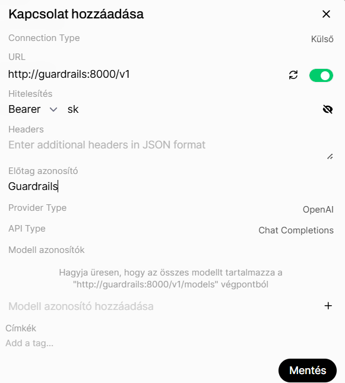

# Guardrails kapcsolat beállítása OpenWebUI-ban

A Guardrails szolgáltatás lehetővé teszi a nyelvi modellek válaszainak ellenőrzését, szűrését és validálását. 

## Beállítások menü

Navigálj ide:

**Beállítások → Kapcsolatok**


Az **OpenAI API kapcsolatok kezelése** szakaszban kattints a **+** ikonra új kapcsolat létrehozásához.

---

# Új Guardrails kapcsolat létrehozása

A megjelenő konfigurációs ablakban add meg az alábbi adatokat:



## Connection Type

```text
Külső
```

A Guardrails szolgáltatás külső OpenAI-kompatibilis API végpontként kerül csatlakoztatásra.

---

## URL

Add meg a Guardrails szolgáltatás elérhetőségét:

```text
http://guardrails:8000/v1
```

---

## Hitelesítés

Válaszd a:

```text
Bearer
```

hitelesítési módot.

A token mezőben add meg a Guardrails API kulcsát.

Példa:

```text
sk
```

vagy

```text
sk-xxxxxxxx
```

A pontos értéket a telepített Guardrails konfiguráció határozza meg.

---

## Előtag azonosító

Az **Előtag azonosító** mező segítségével a kapcsolat egyedi névvel azonosítható az OpenWebUI felületén.

Példa:

```text
Guardrails
```

Ez különösen hasznos több OpenAI-kompatibilis kapcsolat használata esetén.

---

## Provider Type

```text
OpenAI
```

A Guardrails OpenAI-kompatibilis API interfészt biztosít.

---

## API Type

```text
Chat Completions
```

Ez biztosítja az OpenAI Chat Completions API kompatibilitást.

---

## Modell azonosítók

A mező üresen hagyható.

Ebben az esetben az OpenWebUI automatikusan lekéri az elérhető modelleket a következő végpontról:

```text
http://guardrails:8000/v1/models
```

Szükség esetén egyedi modellek is megadhatók.

Példa:

```text
guardrails-chat
guardrails-secure
```

---


# Mentés

Kattints a:

```text
Mentés
```

gombra.

Sikeres mentés után a kapcsolat megjelenik az OpenAI API kapcsolatok listájában.

---

# Működés ellenőrzése

Nyiss egy új beszélgetést, majd válaszd ki a Guardrails kapcsolat által biztosított modellt.

Tesztkérdés:

```text
Írj egy rövid összefoglalót Kovács András munkatársról.
```

Ha a kapcsolat megfelelően működik, a válasz a Guardrails szolgáltatáson keresztül kerül feldolgozásra.

