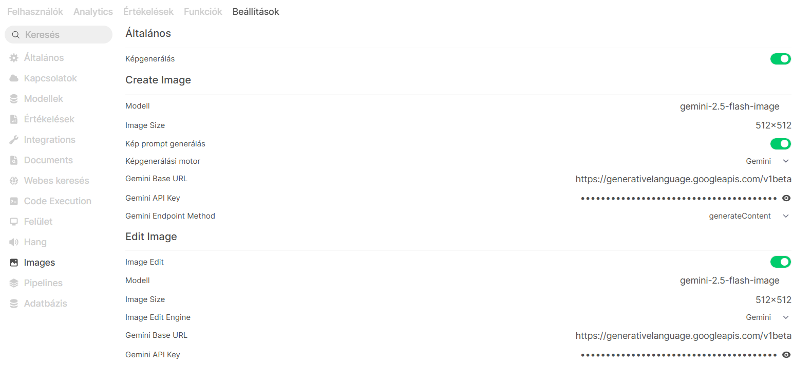

# Képgenerálás beállítása OpenWebUI-ban Gemini használatával

Az OpenWebUI támogatja a mesterséges intelligencia alapú képgenerálást és képszerkesztést. 

## Beállítások menü

Navigálj ide:

**Beállítások → Images**



---

# Kép létrehozása (Create Image)

A **Create Image** szakaszban állítható be az új képek generálása.

## Képgenerálás engedélyezése

Kapcsold be a funkciót a jobb felső sarokban található kapcsolóval.

### Modell

Válaszd ki a használni kívánt Gemini modellt:

```text
gemini-2.5-flash-image
```

### Képméret

Állítsd be a generált képek méretét:

```text
512 × 512
```

### Kép prompt generálás

A **Kép prompt generálás** opció engedélyezése esetén az OpenWebUI automatikusan javíthatja vagy kibővítheti a felhasználó által megadott leírást a jobb minőségű képek érdekében.

Ajánlott beállítás:

```text
Bekapcsolva
```

### Képgenerálási motor

Válaszd ki a képgenerálást biztosító szolgáltatót:

```text
Gemini
```

### Gemini Base URL

A Gemini API alapértelmezett végpontja:

```text
https://generativelanguage.googleapis.com/v1beta
```

### Gemini API Key

Add meg a Google AI Studio vagy Google Cloud által biztosított API kulcsot.

Példa:

```text
AIza...
```

### Gemini Endpoint Method

A Gemini API hívási módja:

```text
generateContent
```

---

# Képszerkesztés (Edit Image)

Az **Edit Image** szakasz lehetővé teszi meglévő képek módosítását.

## Képszerkesztés engedélyezése

Kapcsold be az **Image Edit** funkciót.

### Modell

```text
gemini-2.5-flash-image
```

### Képméret

```text
512 × 512
```

### Képszerkesztő motor

```text
Gemini
```

### Gemini Base URL

```text
https://generativelanguage.googleapis.com/v1beta
```

### Gemini API Key

Ugyanaz az API kulcs használható, mint a képgenerálás esetén.

---

# Mentés

A beállítások módosítása után kattints a:

```text
Mentés
```

gombra.

---

# Működés ellenőrzése

## Új kép generálása

Példa prompt:

```text
Készíts egy futurisztikus városképet naplementében, cyberpunk stílusban.
```

Ha a konfiguráció megfelelő, a modell létrehozza a képet és megjeleníti a beszélgetésben.

## Kép szerkesztése

Tölts fel egy képet, majd adj meg egy módosítási utasítást:

```text
Cseréld ki az égboltot naplementére.
```

A Gemini a feltöltött kép alapján elkészíti a módosított verziót.

