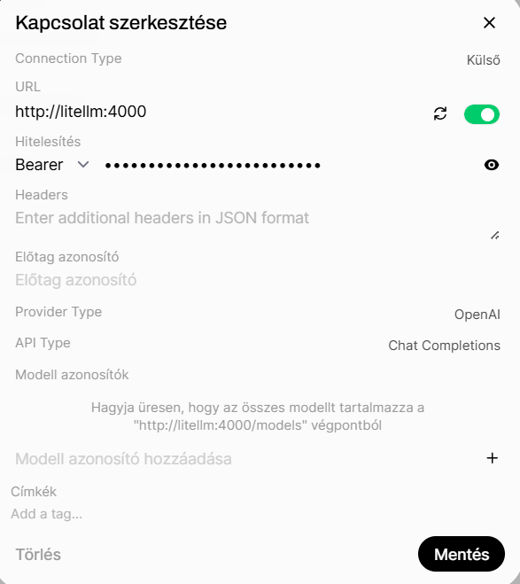

# LiteLLM kapcsolat beállítása OpenWebUI-ban

A LiteLLM egy OpenAI-kompatibilis proxy szolgáltatás, amely lehetővé teszi különböző LLM szolgáltatók (OpenAI, Azure OpenAI, Anthropic, Gemini, Ollama, OpenRouter stb.) egységes kezelését egyetlen API végponton keresztül.

Az OpenWebUI közvetlenül képes csatlakozni a LiteLLM szolgáltatáshoz OpenAI API kompatibilis kapcsolaton keresztül.

## Beállítások menü

Navigálj ide:

**Beállítások → Kapcsolatok**


Az **OpenAI API kapcsolatok kezelése** szakaszban kattints a **+** ikonra új kapcsolat létrehozásához.

---

# Új LiteLLM kapcsolat létrehozása

A megjelenő konfigurációs ablakban add meg az alábbi adatokat:



## Connection Type

```text
Külső
```

## URL

A LiteLLM szolgáltatás URL-je:

```text
http://litellm:4000
```


## Hitelesítés

Válaszd a:

```text
Bearer
```

lehetőséget.

A jelszó mezőbe add meg a LiteLLM API kulcsot.

Példa:

```text
sk-litellm-xxxxxxxx
```


## Provider Type

```text
OpenAI
```

A LiteLLM OpenAI-kompatibilis API-t biztosít, ezért ezt a típust kell kiválasztani.

## API Type

```text
Chat Completions
```

Ez biztosítja a kompatibilitást az OpenAI Chat Completions API-val.

## Modell azonosítók

A mező üresen hagyható.

Ebben az esetben az OpenWebUI automatikusan lekéri az elérhető modelleket a LiteLLM:

```text
/models
```

végpontjáról.

Ha csak bizonyos modelleket szeretnél megjeleníteni, itt manuálisan is megadhatók.

Példa:

```text
gpt-4o
gemini-2.5-pro
```


---

# Mentés

Kattints a:

```text
Mentés
```

gombra.

---

# Működés ellenőrzése

A kapcsolat mentése után nyisd meg a:

**Modellek**

menüt.

Ha a LiteLLM kapcsolat megfelelően működik, az ott konfigurált modellek megjelennek a választható modellek között.

Példa modellek:

```text
gpt-4o
gpt-4.1
claude-3-5-sonnet
gemini-2.5-pro
llama-3.3
```
