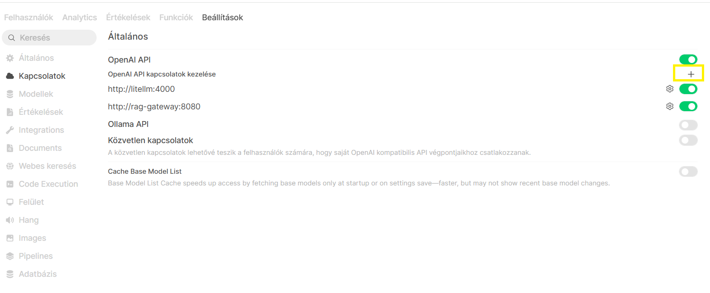
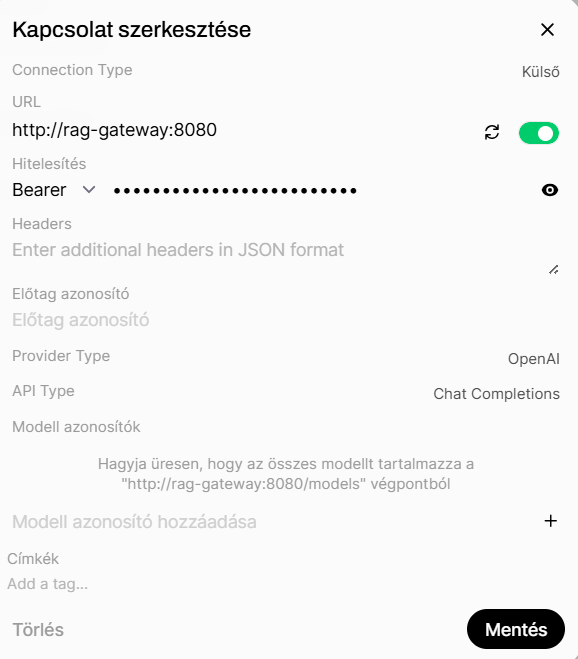

# RAG Gateway kapcsolat beállítása OpenWebUI-ban


## Beállítások menü

Navigálj ide:

**Beállítások → Kapcsolatok**



Az **OpenAI API kapcsolatok kezelése** szakaszban kattints a **+** ikonra új kapcsolat hozzáadásához.

---

# Új RAG Gateway kapcsolat létrehozása

A megjelenő konfigurációs ablakban add meg az alábbi adatokat:



## Connection Type

```text
Külső
```

## URL

Add meg a RAG Gateway szolgáltatás címét:

```text
http://rag-gateway:8080
```


---

## Hitelesítés

Válaszd a:

```text
Bearer
```

hitelesítési módot.

A jelszó mezőbe add meg a RAG Gateway API kulcsát.

Példa:

```text
sk-rag-xxxxxxxx
```

---

## Provider Type

```text
OpenAI
```

A RAG Gateway OpenAI-kompatibilis API-t biztosít, ezért ezt a típust kell használni.

---

## API Type

```text
Chat Completions
```

Ez biztosítja az OpenAI Chat Completion API kompatibilitást.

---

## Modell azonosítók

A mező üresen hagyható.

Ebben az esetben az OpenWebUI automatikusan lekéri az elérhető modelleket a:

```text
http://rag-gateway:8080/models
```

végpontról.

Ha csak bizonyos modelleket szeretnél megjeleníteni, azokat manuálisan is megadhatod.

Példa:

```text
company-rag
knowledge-base
document-assistant
```

---

# Mentés

Kattints a:

```text
Mentés
```

gombra.

Sikeres mentés után a kapcsolat megjelenik az OpenAI API kapcsolatok listájában.

