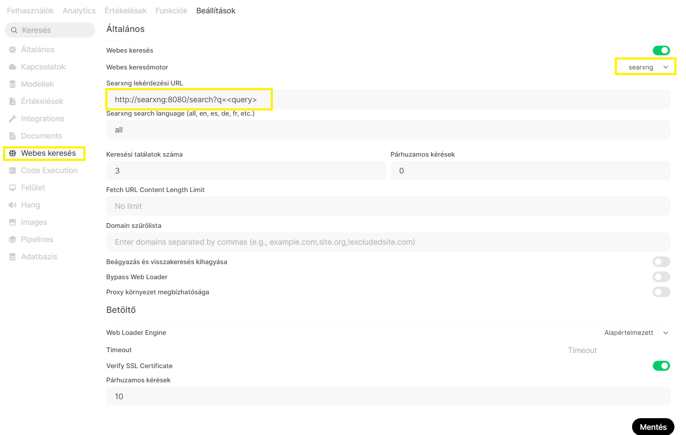

# Webes keresés beállítása OpenWebUI-ban

Az OpenWebUI támogatja a külső keresőmotorok használatát, így a modellek valós idejű információkat tudnak lekérni az internetről. 

## Beállítások menü

Navigálj ide:

**Beállítások → Webes keresés**



## Keresőmotor kiválasztása

A **Webes keresőmotor** legördülő menüben válaszd ki a:

```text
searxng
```

opciót.

## SearXNG lekérdezési URL

A **Searxng lekérdezési URL** mezőbe add meg a SearXNG példány elérési útját:

```text
http://searxng:8080/search?q=<query>
```

### Paraméterek

| Paraméter | Leírás |
|------------|---------|
| `<query>` | Az OpenWebUI által generált keresési kifejezés |
| `http://searxng:8080` | A Docker hálózaton futó SearXNG szolgáltatás címe |

## Nyelvi beállítás

A **Searxng search language** mezőben megadható a keresések nyelve.

Példák:

```text
all
hu
en
de
```

Az `all` érték minden elérhető nyelven engedélyezi a keresést.

## Keresési találatok száma

A **Keresési találatok száma** mezőben állítható be, hogy egy keresés során hány találat kerüljön visszaadásra.

Ajánlott érték:

```text
3
```

## Párhuzamos keresések

A **Párhuzamos keresések** beállítás szabályozza, hogy egyszerre hány keresési kérés fusson.

Fejlesztői vagy kisebb környezetben jellemzően:

```text
0
```

vagy

```text
3
```

érték elegendő.

## Mentés

A beállítások módosítása után kattints a jobb alsó sarokban található:

```text
Mentés
```

gombra.

## Ellenőrzés

A konfiguráció mentése után egy új beszélgetésben kapcsold be a **Web Search** funkciót, majd próbálj ki egy aktuális információt igénylő kérdést:

```text
Mennyi a forint árfolyama?
```

Ha a válasz webes forrásokat tartalmaz, akkor a SearXNG integráció megfelelően működik. 