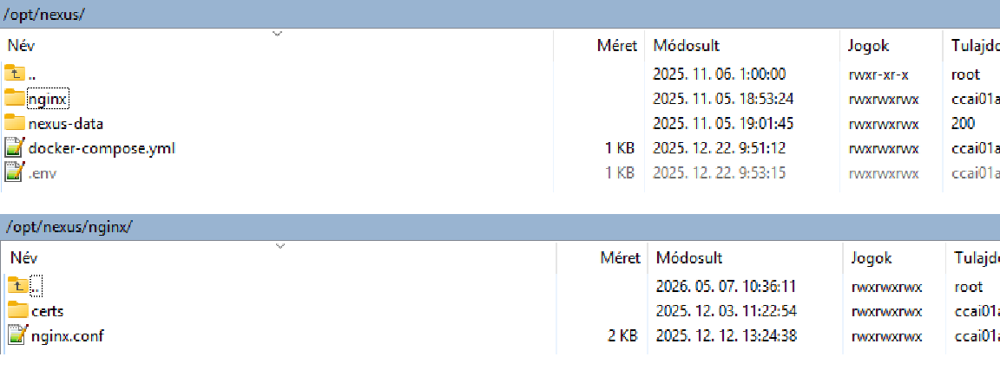
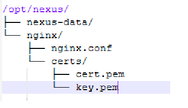
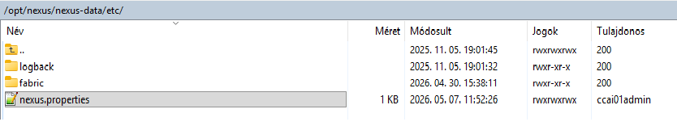
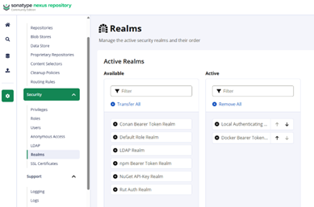
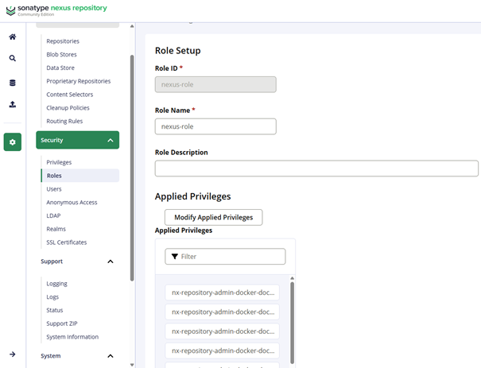
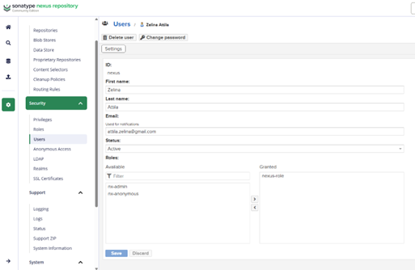
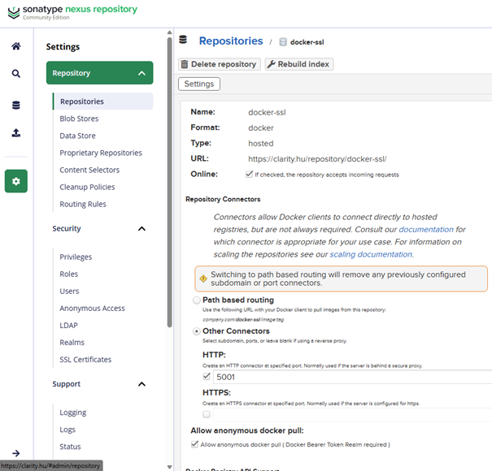

# Nexus telepítés

##  Struktúra kialakítása


##  Docker compose

```bash
version: "3.8"

services:
  nexus:
    image: ${NEXUS_IMAGE}
    container_name: ${NEXUS_CONTAINER_NAME}
    restart: unless-stopped
    ports:
      - "${NEXUS_HTTP_PORT}:${NEXUS_CONTAINER_PORT}"
      - "${NEXUS_DOCKER_PORT}:${NEXUS_DOCKER_PORT}"
    environment:
      NEXUS_SECURITY_RANDOMPASSWORD: "${NEXUS_RANDOM_PASSWORD}"
    volumes:
      - "${NEXUS_DATA_DIR}:/nexus-data"
    networks:
      - nexus-net

  nginx:
    image: ${NGINX_IMAGE}
    container_name: ${NGINX_CONTAINER_NAME}
    restart: unless-stopped
    ports:
      - "${NGINX_HTTPS_PORT}:443"
    volumes:
      - "${NGINX_CONF}:/etc/nginx/nginx.conf:ro"
      - "${NGINX_CERTS_DIR}:/etc/nginx/certs:ro"
    depends_on:
      - nexus
    networks:
      - nexus-net

networks:
  nexus-net:
    driver: bridge
```

### Nexus Repository + Nginx
Ez a stack egy privát artifact és Docker registry infrastruktúrát biztosít:

- Maven repository
- Docker image registry
- belső package tárolás
- HTTPS reverse proxy

A fő komponens a Sonatype Nexus Repository Manager.

### Nexus service

| Tulajdonság    | Érték                     | Magyarázat                                                                                   |
| -------------- | ------------------------- | -------------------------------------------------------------------------------------------- |
| Service név    | nexus                     | A Compose logikai service neve. Más konténerek ezen a néven érik el a repository-t.          |
| Image          | `${NEXUS_IMAGE}`          | A használt Nexus image. Environment változóból jön, így könnyen verziózható vagy cserélhető. |
| Konténer név   | `${NEXUS_CONTAINER_NAME}` | A futó konténer fix neve, ami debugnál hasznos (`docker logs`, `docker exec`).               |
| Restart policy | unless-stopped            | A konténer automatikusan újraindul Docker restart vagy crash után.                           |
| Hálózat        | nexus-net                 | Elkülönített belső bridge hálózat a Nexus stack számára.                                     |


### Portok

| Port                                         | Jelentés                 |
| -------------------------------------------- | ------------------------ |
| `${NEXUS_HTTP_PORT}:${NEXUS_CONTAINER_PORT}` | Nexus web UI és API      |
| `${NEXUS_DOCKER_PORT}:${NEXUS_DOCKER_PORT}`  | Docker registry endpoint |


### Környezeti változók

| Változó                       | Jelentés                                            |
| ----------------------------- | --------------------------------------------------- |
| NEXUS_SECURITY_RANDOMPASSWORD | Első induláskor generált admin jelszó engedélyezése |

Ha true:

- Nexus generál egy kezdeti admin jelszót
- ez a /nexus-data/admin.password fájlba kerül

### Volume-ok

| Volume              | Cél           | Típus |
| ------------------- | ------------- | ----- |
| `${NEXUS_DATA_DIR}` | `/nexus-data` | RW    |

Itt tárolódik:

- repository adat
- Docker image-ek
- Maven artifactok
- konfiguráció
- user adatbázis

##  Nginx service

A NGINX reverse proxy-ként működik a Nexus előtt:

- HTTPS terminálás
- SSL certificate kezelés
- publikus elérés

###   Alap adatok

| Tulajdonság    | Érték                     | Magyarázat                                  |
| -------------- | ------------------------- | ------------------------------------------- |
| Service név    | nginx                     | Reverse proxy service neve                  |
| Image          | `${NGINX_IMAGE}`          | Használt NGINX image                        |
| Konténer név   | `${NGINX_CONTAINER_NAME}` | Fix konténer név                            |
| Restart policy | unless-stopped            | Automatikus újraindítás                     |
| Hálózat        | nexus-net                 | Ugyanazon belső hálózaton fut, mint a Nexus |


###   Portok

| Port                      | Jelentés                |
| ------------------------- | ----------------------- |
| `${NGINX_HTTPS_PORT}:443` | HTTPS publikus endpoint |

###   Volume-ok

| Volume               | Cél                     | Típus |
| -------------------- | ----------------------- | ----- |
| `${NGINX_CONF}`      | `/etc/nginx/nginx.conf` | RO    |
| `${NGINX_CERTS_DIR}` | `/etc/nginx/certs`      | RO    |

###   SSL szerep

Az NGINX kezeli:

- TLS/SSL kapcsolatot
- certificate-eket
- HTTPS redirectet

###   Függőségek

| Service | Szerep                     |
| ------- | -------------------------- |
| nexus   | backend repository service |


###   Hálózat

| Beállítás | Érték  |
| --------- | ------ |
| Driver    | bridge |

Izolált belső hálózat:

- Nexus ↔ NGINX kommunikáció
- service discovery
- elkülönítés más stackektől

###   Teljes architektúra

```bash
Developer / CI
       ↓
     HTTPS
       ↓
     NGINX
       ↓
     Nexus
       ↓
Docker / Maven repository
```

## .env fájl

A .env fájl tartalmazza a Docker Compose stack konfigurálható paramétereit.

Előnyei:

- könnyebb környezetváltás (dev/test/prod)
- központi konfiguráció
- egyszerűbb port- és path-kezelés

### Nexus beállítások

```bash
---- Nexus ----
NEXUS_IMAGE=sonatype/nexus3
NEXUS_CONTAINER_NAME=nexus
NEXUS_HTTP_PORT=8082
NEXUS_CONTAINER_PORT=8081
NEXUS_DOCKER_PORT=5001
NEXUS_DATA_DIR=/opt/nexus/nexus-data
NEXUS_RANDOM_PASSWORD=false

# ---- Nginx ----
NGINX_IMAGE=nginx:latest
NGINX_CONTAINER_NAME=nginx
NGINX_HTTPS_PORT=8443
NGINX_CONF=/opt/nexus/nginx/nginx.conf
NGINX_CERTS_DIR=/opt/nexus/nginx/certs
```

| Változó               | Érték                 | Magyarázat                                                                                                                                           |
| --------------------- | --------------------- | ---------------------------------------------------------------------------------------------------------------------------------------------------- |
| NEXUS_IMAGE           | sonatype/nexus3       | A használt **[Sonatype Nexus Repository Manager](https://www.sonatype.com/products/sonatype-nexus-repository?utm_source=chatgpt.com)** Docker image. |
| NEXUS_CONTAINER_NAME  | nexus                 | A futó Docker konténer neve. Debugolásnál és logolásnál hasznos.                                                                                     |
| NEXUS_HTTP_PORT       | 8082                  | A host oldali port, amin a Nexus webes felülete elérhető lesz.                                                                                       |
| NEXUS_CONTAINER_PORT  | 8081                  | A Nexus belső portja a konténeren belül.                                                                                                             |
| NEXUS_DOCKER_PORT     | 5001                  | A Docker registry portja. Docker image push/pull ezen keresztül történik.                                                                            |
| NEXUS_DATA_DIR        | /opt/nexus/nexus-data | A host oldali könyvtár, ahol a Nexus minden adatát tárolja.                                                                                          |
| NEXUS_RANDOM_PASSWORD | false                 | Meghatározza, hogy a Nexus generáljon-e véletlen admin jelszót induláskor.                                                                           |

### Adat tárolás

/opt/nexus/nexus-data

Itt tárolódik:

- Docker image-ek
- Maven artifactok
- user adatok
- konfigurációk
- repository metaadatok

⚠️ Ez kritikus adat → backup szükséges.

### Nginx beállítások

| Változó              | Érték                       | Magyarázat                                           |
| -------------------- | --------------------------- | ---------------------------------------------------- |
| NGINX_IMAGE          | nginx:latest                | A használt **NGINX** image.                          |
| NGINX_CONTAINER_NAME | nginx                       | A futó reverse proxy konténer neve.                  |
| NGINX_HTTPS_PORT     | 8443                        | A host oldali HTTPS port.                            |
| NGINX_CONF           | /opt/nexus/nginx/nginx.conf | Az NGINX konfigurációs fájl helye a host rendszeren. |
| NGINX_CERTS_DIR      | /opt/nexus/nginx/certs      | SSL/TLS certificate-ek könyvtára.                    |

### HTTPS működés

Client
   ↓ HTTPS :8443
NGINX
   ↓ HTTP
Nexus

- kezeli az SSL kapcsolatot
- továbbítja a kéréseket a Nexus felé
- reverse proxy szerepet tölt be

### Könyvtár struktúra



### Certificate kezelés

A 'NGINX_CERTS_DIR' könyvtár tartalmazza:

- public certificate
- private key
- opcionális CA lánc

## nginx.conf 

```bash
events {}

http {
    # Alap loggolás hibakereséshez
    access_log /var/log/nginx/access.log;
    error_log /var/log/nginx/error.log;

    server {
        listen 443 ssl;
        server_name aiclarity.hu;

        ssl_certificate /etc/nginx/certs/aiclarity_hu.crt;
        ssl_certificate_key /etc/nginx/certs/aiclarity.hu.key;

        ssl_protocols TLSv1.2 TLSv1.3;
        ssl_ciphers HIGH:!aNULL:!MD5;
        ssl_prefer_server_ciphers on;

        # Nexus UI (web felület)
        location / {
            proxy_pass http://nexus:8081;       # <--- FONTOS: 8081 az UI port!
            proxy_set_header Host $host:8443;
            proxy_set_header X-Real-IP $remote_addr;
            proxy_set_header X-Forwarded-For $proxy_add_x_forwarded_for;
            proxy_set_header X-Forwarded-Proto https;
        }

        # Docker registry proxy
        location /v2/ {
			proxy_pass http://nexus:5001;  # belső Docker port
            proxy_set_header Host $host:8443;   # ne legyen $server_port
            proxy_set_header X-Real-IP $remote_addr;
            proxy_set_header X-Forwarded-For $proxy_add_x_forwarded_for;
            proxy_set_header X-Forwarded-Proto https;
            proxy_set_header Docker-Distribution-Api-Version registry/2.0;

			client_max_body_size 0;
			chunked_transfer_encoding on;
		}
    }
}
```

## nexus.properties



```bash
# Nexus alapbeállítások
application-host=0.0.0.0
application-port=8081
```

| Beállítás        | Érték   | Magyarázat                                                                                                                     |
| ---------------- | ------- | ------------------------------------------------------------------------------------------------------------------------------ |
| application-host | 0.0.0.0 | Meghatározza, hogy a Nexus mely hálózati interfészeken figyeljen. A `0.0.0.0` azt jelenti: minden interfészen elérhető legyen. |
| application-port | 8081    | A Nexus belső HTTP portja, amelyen a web UI és API fut a konténeren belül.                                                     |

## Hosts fájl beállíás
```bash
sudo nano /etc/hosts
{{host_file_nexus}}
```

### Admin felület elérése

{{nexus_url}}

### Bearer Token beállítása



### Nexus-role beállítása

Létre kell hozni egy nexus-role -role-t és be kell állítani a Privileges-ben minden docker-es elemet.


### User létrehozása

Létre kell hozni egy nexus user-t és hozzá kell adni a nexus-role -t, amit létrehoztunk.


Ne felejtsd el elmenteni.

### Docker-ssl repository létrehozása

Hozz létre egy docker-ssl repository-t az alábbiak szerint, ehhez fogunk loginolni:


## Https certek beállítása

Az Nginx service fejezetben leírtak szerint kell a megfelelő helyre másolni a cert-eket.

### Tanúsítvány felvétele a Docker kliensbe (KÖTELEZŐ)

```bash
sudo mkdir -p /etc/docker/certs.d/{{nexus_url_without_https}}
sudo cp aiclarity_hu.crt /etc/docker/certs.d/{{nexus_url_without_https}}/ca.crt
sudo systemctl restart docker
```

### Indítás, megállítás

```bash
docker-compose down
docker-compose up -d
```

## Image kezelés

### Bejelentkezés a registry-be

```bash
docker login {{nexus_url_without_https}} -u admin -p admin123

default: admin / admin123
```

### Image készítése

Nézzünk egy példát, ha a guardrails mappában van Dockerfile-om, akkor elkészítjük az image-et.

```bash
docker build -t guardrails:local ./guardrails
```

### Tag-elés

```bash
docker tag guardrails:local {{nexus_url_without_https}}/docker-ssl/guardrails:1.0.0
```

Bejelentkezés a registry-be az előző pontban leírtak alapján.

### Feltöltés a repository-ba

```bash
docker push {{nexus_url_without_https}}/docker-ssl/guardrails:1.0.0
```

### Hivatkozás egy image-re pull során

pl: docker pull domain:port/repository-name/image-name:tag

```bash
docker pull {{nexus_url_without_https}}/docker-ssl/guardrails:1.0.0
```

### Hivatkozás egy image-re a compose fájl-ban
Az alábbi módon lehet hivatkozni a compose fájl-ban:

```bash
guardrails:
  image: {{nexus_url_without_https}}/docker-ssl/guardrails:1.0.0
  container_name: guardrails
  restart: unless-stopped
```


