# HashiCorp Vault telepítési leírás

**Dátum:** 2026.04.11.  
**Verzió:** v1.0  
**Szerző:** Zelina Attila  

---

## Dokumentum kontroll

| Dátum       | Verzió | Szerző        | Megjegyzés                                   |
|------------|--------|---------------|----------------------------------------------|
| 2026.03.13 | 1.0    | Zelina Attila | Első draft verzió                            |
| 2026.03.13 | 1.1    | Katona Ádám   | Kisebb kiegészítések és Markdown formátumra alakítás |
| 2026.03.25 | 1.1    | Zelina Attila | Telepítések során előjött finomítások átvezetése |

---

## Docker compose fájl és magyarázata
```bash
version: "3.8"

services:
  vault:
    image: hashicorp/vault:latest
    container_name: vault
    restart: unless-stopped
    cap_add:
      - IPC_LOCK
    environment:
      VAULT_ADDR: "http://vault:8200"   # belső HTTP port
    volumes:
      - ./vault-data:/vault/data
      - ./vault-config:/vault/config
      - ./ldap:/vault/ldap
    command: vault server -config=/vault/config/vault.hcl
    networks:
      - llmnet

  nginx:
    image: nginx:latest
    container_name: nginx
    restart: unless-stopped
    ports:
      - "8444:443"      # HTTPS a böngésző felé
    volumes:
      - ./nginx/nginx.conf:/etc/nginx/nginx.conf:ro
      - ./nginx/certs:/etc/nginx/certs:ro
    depends_on:
      - vault
    networks:
      - llmnet

networks:
  llmnet:
    external: true
``` 

###Vault szolgáltatás
| Elem                            | Jelentés                                                 |
| :------------------------------ | :------------------------------------------------------- |
| `vault:`                        | A HashiCorp Vault szolgáltatás neve                      |
| `image: hashicorp/vault:latest` | Használt Docker image (legfrissebb verzió)               |
| `container_name: vault`         | Fix konténernév                                          |
| `restart: unless-stopped`       | Automatikus újraindítás, kivéve ha manuálisan leállítják |
| `cap_add: IPC_LOCK`             | Megakadályozza, hogy a titkok swap-be kerüljenek         |
| `environment: VAULT_ADDR`       | Belső elérési cím (`http://vault:8200`)                  |
| `./vault-data:/vault/data`      | Perzisztens adat tárolás                                 |
| `./vault-config:/vault/config`  | Konfigurációs fájlok                                     |
| `./ldap:/vault/ldap`            | LDAP konfiguráció / tanúsítványok                        |
| `command`                       | Vault indítása a `vault.hcl` config alapján              |
| `networks: llmnet`              | Csatlakozás a közös Docker hálózathoz                    |


###Nginx szolgáltatás
| Elem                      | Jelentés                         |
| :------------------------ | :------------------------------- |
| `nginx:`                  | A NGINX szolgáltatás             |
| `image: nginx:latest`     | Nginx Docker image               |
| `container_name: nginx`   | Fix konténernév                  |
| `restart: unless-stopped` | Automatikus újraindítás          |
| `ports: 8444:443`         | Host 8444 → konténer 443 (HTTPS) |
| `nginx.conf`              | Egyedi konfiguráció (read-only)  |
| `certs`                   | SSL tanúsítványok (read-only)    |
| `depends_on: vault`       | Vault indulása után indul        |
| `networks: llmnet`        | Közös hálózat                    |


###Hálózat
| Elem             | Jelentés                                         |
| :--------------- | :----------------------------------------------- |
| `llmnet`         | Külső Docker hálózat                             |
| `external: true` | A hálózat már létezik, nem a Compose hozza létre |


###Adatfolyam
| Forrás   | Cél    | Leírás                                 |
| :------- | :----- | :------------------------------------- |
| Böngésző | Nginx  | HTTPS kérés (`https://localhost:8444`) |
| Nginx    | Vault  | Reverse proxy a belső hálón            |
| Vault    | Volume | Titkok és adatok mentése               |

## ELŐFELTÉTEL

Előfeltétel:

- Python 3.10 vagy újabb
- Docker Desktop
- Git

Klónozzuk a `CLA_AI_KERET_2025` repository `develop` branch-ét:

```bash
git clone -b develop <repo-url>
```

Ajánlott elérési út:

```
C:/Users/username/GIT/CLA_AI_KERET_2025
```

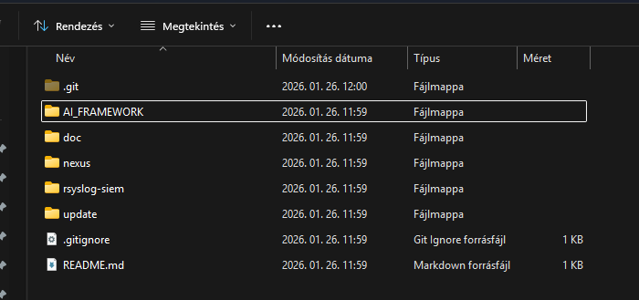

>    Az `AI_FRAMEWORK` mappában a `.sh` és `.yml` fájlokat Unix karakterkódolásra kell állítani.  
>    Ellenkező esetben Docker futtatáskor hiba léphet fel.


## Python scriptek futtatása

Navigáljunk:

```
AI_FRAMEWORK/start_scripts
```

## Verzió ellenőrzése

"Linux"

```bash
python --version
```

"Windows (PowerShell)"

```bash
python --version
```
A következő parancsot futtasd a szkript elindításához:

```bash
python scan_char_encoding_transform.py <DIR>
```

## Docker indítása

Navigáljunk az `AI_FRAMEWORK` mappába (ahol a `docker-compose.yml` található).

```bash
docker compose up -d # indítás
docker compose ps # listázás
docker compose down -v # leállítás, a volume-ot is törli
docker compose down # leállítás
```

>    Ha olyan image-et használsz, ami a nexusból érkezik, akkor ne felejts el PUTTY-al felcsatlakozni a szerverre
>    és a host fájlban a `172.28.10.13 aiclarity.hu` legyen irányítva!

## Telepítés

"Linux"
Amennyiben Linux alatt telepítünk, abban az esetben másoljuk fel a `hashicorp-vault` mappát a szerverre, ez megtalálható a Git-ben a hashicorp-vault néven

### vault-data mappa létrehozása

```bash
mkdir -p ~/ccaikeret/hashicorp-vault/vault-data
```

### Tulajdonjog beállítása

```bash
sudo chown -R 100:100 /home/ccai01admin/ccaikeret/hashicorp-vault/vault-data
```

### Jogosultság beállítása

```bash
chmod 755 ~/ccaikeret/hashicorp-vault/vault-data
```

### Futtathatóvá tétel

```bash
sudo chmod -R +x /home/ccai01admin/ccaikeret
```


### Docker network létrehozása

```bash
docker network create llmnet
```

### Indítás
A `CLA_AI_KERET_2025\hashicorp-vault` alatt adjuk ki a parancsot
```bash
docker compose up -d
```

### Inicializálás

```bash
docker exec -e VAULT_ADDR=http://127.0.0.1:8200 -it vault vault operator init
```

>    A megjelenő Unseal kulcsokat és Root Tokent biztonságosan el kell menteni a kdbx fájlba.
    
### Unseal

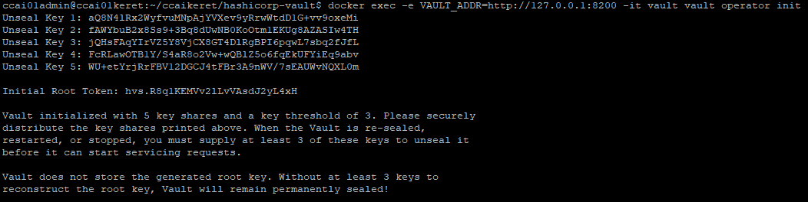

```bash
docker exec -it vault vault operator unseal <KEY1>
docker exec -it vault vault operator unseal <KEY2>
docker exec -it vault vault operator unseal <KEY3>
```

Ha:

```
sealed = false
```

akkor a Vault aktív.

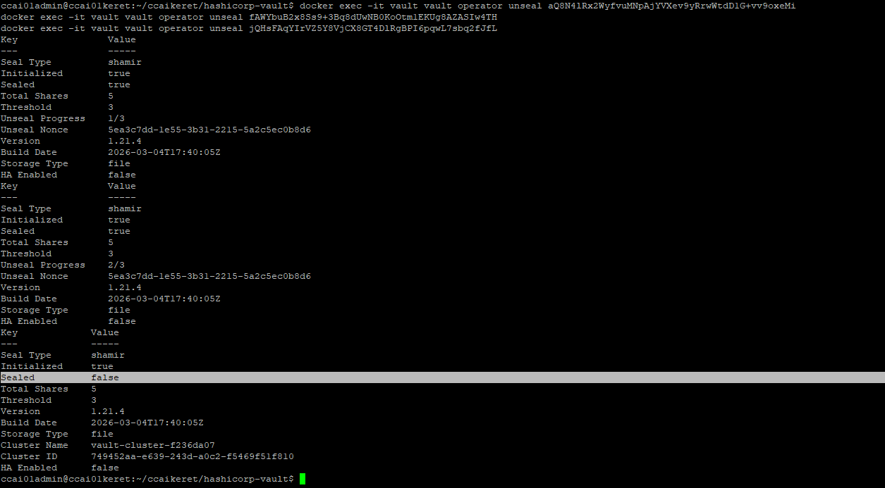


### HTTPS beállítás

Hosts fájlba:

```
<IP> vault.devaiclarity.hu
```

### Cert-ek beállítása

Másoljuk be a cert fájlokat:

```
hashicorp-vault/nginx/certs/
```

Majd módosítsuk:

```
hashicorp-vault/nginx/nginx.conf
```

### Admin felület

```bash
https://vault.devaiclarity.hu:8444
```


"Windows (PowerShell)"
Amennyiben Windows alatt telepítünk, abban az esetben az alábbiakat kell elvégznünk.

### vault-data mappa létrehozása
Belépünk a `hashicorp-vault` mappába és kiadjuk a parancsot CMD-ben:
```bash
mkdir vault-data
```
### Docker network létrehozása

```bash
docker network create llmnet
```

### Indítás
A `CLA_AI_KERET_2025\hashicorp-vault` alatt adjuk ki a parancsot
```bash
docker compose up -d
```

### HTTPS beállítás

Hosts fájlba:

```bash
<IP> vault.devaiclarity.hu
```

### Cert-ek beállítása

Ellenőrizzük a cert fájlokat:

```bash
hashicorp-vault/nginx/certs/
```

Majd ellenőrizzük az nginx.conf fájlt, hogy létezik-e:

```bash
hashicorp-vault/nginx/nginx.conf
```

### Admin felület

```bash
https://vault.devaiclarity.hu:8444
```


## Vault beállítások

### Login a vaultba

```bash
docker exec -it vault vault login <ROOT_TOKEN>
```


### Secrets engine engedélyezése

```bash
docker exec -e VAULT_ADDR=http://127.0.0.1:8200 -it vault vault secrets enable -path=secret kv-v2
```


"Linux"

### Secretek feltöltése

Aktiváljuk a python virtuális környezetet, ezt már korábban létrehoztuk, pl: AI_FRAMEWORK\venv
```bash
source venv/bin/activate
```
A `CC_MI_keretrendszer.kdbx` fájlnak a `CLA_AI_KERET_2025\hashicorp-vault` szinten kell lennie.
Lépjünk be a hashicorp-vault\kdbx\ mappába.


```bash
python vault_update_from_kdbx.py
```

"Windows (PowerShell)"

### Secretek feltöltése
Aktiváljuk a python virtuális környezetet, ezt már korábban létrehoztuk, pl: AI_FRAMEWORK\venv
```bash
.\.venv\Scripts\activate
```
A `CC_MI_keretrendszer.kdbx` fájlnak a `CLA_AI_KERET_2025\hashicorp-vault` szinten kell lennie.
Lépjünk be a hashicorp-vault\kdbx\ mappába.
```bash
python vault_update_from_kdbx.py
```
	
A vault felületén a következőt kell, hogy lássuk, miután feltötlöttük a secreteket:


### Vault-config beállítások

Ellenőrizzük, hogy a fájlok a `vault-config` mappában megtalálhatóak


### AppRole engedélyezés

```bash
docker exec -e VAULT_ADDR=http://127.0.0.1:8200 -it vault vault auth enable approle
```

## AppRole létrehozása

### IP lekérdezés 

```bash
docker network inspect llmnet
```

--A kép, csak illusztráció


Mivel a vault-ot kell először telepíteni, lekérdezzük az ip tartományt, hogy ezt később feltudjuk használni és beállítani a Framework telepítésnél. 
Fontos, hogy ebben a tartományban kell a többi konténernek is elindulni. Ezt az ip beállítást aktualizálni kell a Framework-ban is.

### Role létrehozás

Most csinálunk egy role-t az agentnek, docker network-ot állítunk be, ez azért fontos, mert csak a docker networkből enged be
klienseket, kívülről nem. És itt is, csak a vault-agent tud lekérdezni, aminek beállítjuk fixen a 172.22.0.42 ip-t.

Fontos megjegyezni, hogy jelen esetben a 162.22... a tartomány, ebben lesznek kiosztva az ip címek a konténeren belül. Erre nagyon kell figyelni, hogy egységesen állítsuk be.
A ...0.42 pedig egy fix ip cím lesz, amit a vault-agent-nek állítunk be a Framework compose fájlban.

>   A docker-compose.yml állományban a `vault-agent`-nek az IP címét `172.22.0.42`-re állítottuk, ellenőrizzük,
>   hogy ez nem változott, valamint, hogy a `subnet` a `172.22.0.0/16` tartományra van állítva

"Linux"
```bash
docker exec -e VAULT_ADDR=http://127.0.0.1:8200 -it vault \
vault write auth/approle/role/vault-agent-role \
bind_secret_id=false \
token_policies="agent-policy" \
token_period=1h \
token_ttl=1h \
token_max_ttl=4h \
token_bound_cidrs="172.22.0.42/16"
```
"Windows (PowerShell)"
```bash
docker exec -e VAULT_ADDR=http://127.0.0.1:8200 -it vault `
vault write auth/approle/role/vault-agent-role `
bind_secret_id=false `
token_policies="agent-policy" `
token_period=1h `
token_ttl=1h `
token_max_ttl=4h `
token_bound_cidrs="172.22.0.42/16"
```

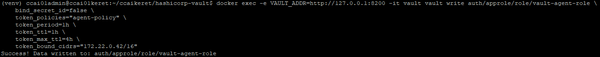

### Policy feltöltés, frissítés

```bash
ccai01admin@ccai01keret:~/ccaikeret/vault-agent$ docker exec -it vault vault policy write agent-policy /vault/config/agent-policy.hcl
```

### Role lekérdezése

```bash
docker exec -e VAULT_ADDR=http://127.0.0.1:8200 -it vault vault read auth/approle/role/vault-agent-role
```

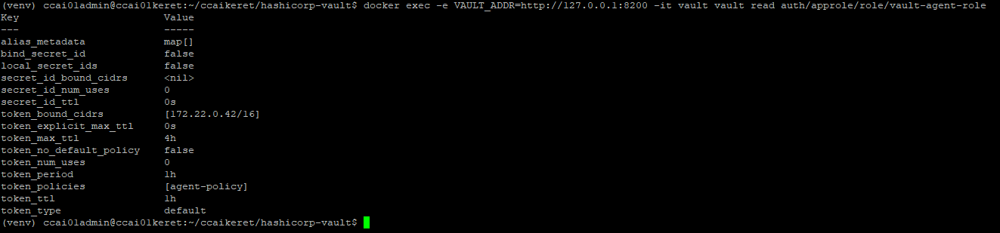

### Role ID lekérdezése

```bash
docker exec -e VAULT_ADDR=http://127.0.0.1:8200 -it vault vault read auth/approle/role/vault-agent-role/role-id
```

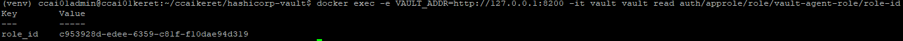

A role_id-t el kell menteni.

## Vault Agent integráció (AppRole)

A rendszer a `HashiCorp Vault Agent` segítségével tölti be a konténerek számára szükséges érzékeny adatokat (jelszavak, API kulcsok, tokenek). A Vault Agent AppRole autentikációval (role_id) csatlakozik a Vault szerverhez, majd a szükséges titkokat fájlok formájában elérhetővé teszi a konténerek számára.
A cél az, hogy se jelszó, se API kulcs ne szerepeljen a docker-compose fájlban vagy environment változókban, hanem minden titok dinamikusan a Vaultból kerüljön betöltésre.

A Vault Agent:

1. Autentikál a Vault szerverhez
2. Titkokat lekér
3. Fájlba renderel
4. Más konténerek számára elérhetővé teszi

A titkok tmpfs Docker volume-ba kerülnek.
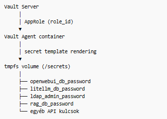


### Template alapú secret generálás

A Vault Agent template rendszere segítségével a Vaultban tárolt titkok fájlokká kerülnek renderelésre.

Példa template logika:

```bash

{{ with secret "secret/data/openwebui" }}
{{ .Data.data.password }}
{{ end }}

```

A template fájlok helye: `AI_FRAMEWORK/vault-agent/templates`

### Vault-agent.hcl

Az alábbi helyen érhetőel `AI_FRAMEWORK/vault-agent/vault-agent.hcl`
!!! info "Template" 
    Új komponens esetén bővíteni kell a `vault-agent.hcl`-t 

- AppRole autentikációval belép a Vaultba (`auth/approle`)
- A tokent fájlba menti: `/secrets/.vault-token`
- Secretet template alapján fájlba renderel pl.:
    - `openwebui_db_password`
    - `ldap_readonly_user_password`
    - `ldap_admin_password`
- Sikeres autentikáció és renderelés után kilép (`exit_after_auth = true`)

### Agent-policy.hcl

A policy definiálja:

- Milyen secret pathokat érhet el az alkalmazás
- Milyen műveleteket végezhet (read, list, create stb.)

A Vault Agent az AppRole autentikáció után kap egy `Vault tokent`, amelyre ez a policy érvényes.

### Role_id lekérdezése és beállítása

```bash
docker exec -e VAULT_ADDR=http://127.0.0.1:8200 -it vault vault read auth/approle/role/vault-agent-role/role-id
```

A lekérdezett role_id-t be kell másolni a `AI_FRAMEWORK/vault-agent/role_id` fájl-ba.

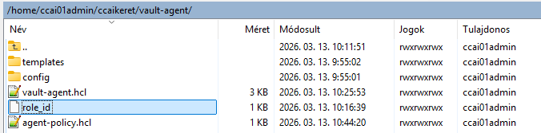

### Konténerek ip tartományának beállítása a compose fájlban

A `AI_FRAMEWORK/docker-compose.yml` állományban a `172.19.0.0/16` IP tartomány kell, hogy szerepeljen


### Memóriában tárolt temp létrehozása a compose fájlban


 
### Secrets törlése
A rendszer tartalmaz egy cleanup konténert is: `vault-cleanup`. Ez 180 másodperc után törli a secret fájlokat:
`rm -rf /secrets/*`. Ez további biztonsági réteget ad a rendszerhez.

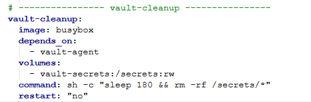

### Vault agent létrehozása a konténerben
Korábban a vault-ban beállítottuk, hogy a `172.19.0.42`-es ip-ről és role_id-val autentikált tokennel lehet csak lekérdezni a secret-eket. Ez a beállítás fontos, hogy összhangban legyen a vault-ban leírtakkal.
A konténer egyszer megfut, betölti a titkokat, megáll és nem indul újra.


## LDAP integráció

Fontos megjegyezni, hogy az LDAP integrációhoz szükséges elindítani az LDAP-ot, amit jelenleg még nem lehetséges.
Ha sikeresen feltelepítettük a Vault-ot és integráltuk a Framework-ot, akkor az LDAP is sikeresen elindul. Ezt követően kell az alábbi integrációt elvégezni.

### LDAP engedélyezése

```bash
docker exec -e VAULT_ADDR=http://127.0.0.1:8200 -it vault vault auth enable ldap
```

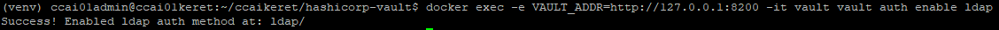

### LDAP konfigurálása

"Linux"

```bash
docker exec -e VAULT_ADDR=http://127.0.0.1:8200 -it vault \
vault write auth/ldap/config \
url="ldap://openldap:389" \
userdn="ou=users,dc=clarity,dc=hu" \
groupdn="ou=groups,dc=clarity,dc=hu" \
binddn="cn=admin,dc=clarity,dc=hu" \
bindpass="********" \
starttls=false \
insecure_tls=true \
userattr="uid"
```
"Windows (PowerShell)"

```bash
docker exec -e VAULT_ADDR=http://127.0.0.1:8200 -it vault `
vault write auth/ldap/config `
url="ldap://openldap:389" `
userdn="ou=users,dc=clarity,dc=hu" `
groupdn="ou=groups,dc=clarity,dc=hu" `
binddn="cn=admin,dc=clarity,dc=hu" `
bindpass="********" `
starttls=false `
insecure_tls=true `
userattr="uid"
```

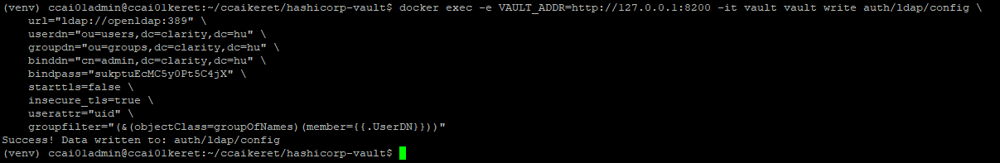

### Policy betöltés

```bash
docker exec -it vault vault policy write llm-admins /vault/ldap/llm-admins.hcl
```

### Csoport-policy hozzárendelés az LDAP-hoz

```bash
docker exec -e VAULT_ADDR=http://127.0.0.1:8200 -it vault vault write auth/ldap/groups/llm-admins policies="llm-admins"
```

### Token lejárat beállítása

Ha Alice megváltoztatja az LDAP jelszavát, a régi Vault tokenje még működik a lejáratig, ez Vault design.
Ezért csökkenteni kell a token lejáratát, így jelszócsere után max 1 órán belül minden session megszűnik.

```bash
docker exec -e VAULT_ADDR=http://127.0.0.1:8200 -it vault vault login <ROOT_TOKEN_ID>
```
```bash
docker exec -e VAULT_ADDR=http://127.0.0.1:8200 -it vault vault auth tune -default-lease-ttl=1h -max-lease-ttl=24h ldap/
```


### Ellenőrzés

```bash
docker exec -e VAULT_ADDR=http://127.0.0.1:8200 -it vault  vault auth list -detailed
```


## HASZNOS PARANCSOK

### LLMNETRE terelés:

```bash
docker network connect llmnet vault
```

### Futtatási jog beállítás egy sh fájlra

"Linux"

```bash
chmod +x litellm-oauth2-proxy/litellm-oauth-secrets.sh
```
	
### Nexusra kapcsolódás

```bash
docker login aiclarity.hu:8443
```

### AppRole lekérdezés

```bash
docker exec -it vault vault list auth/approle/role
```

### Olvasd ki a token policy-t:

```bash
docker exec -it vault  vault read auth/approle/role/vault-agent-role
```

### Docker vault-agent ip lekérdezés

```bash

docker inspect -f '{{range .NetworkSettings.Networks}}{{.IPAddress}}{{end}}' vault-agent

```

### Vault integráció (Vault Agent)

[Vault Agent](../framework_components/vault-agent.md)


