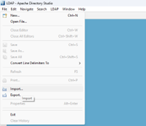
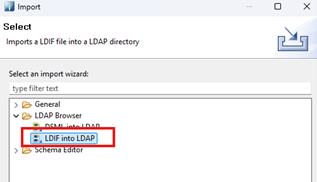
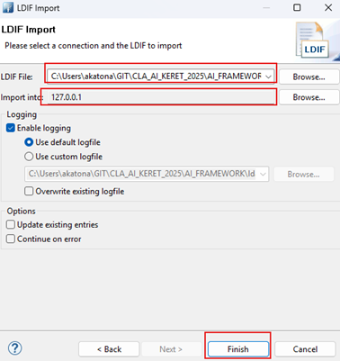
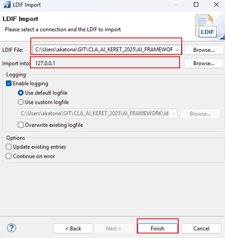
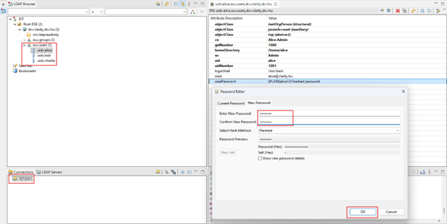

# OpenLDAP

## Cél

Az `openldap` a címtár és csoportkezelési backend.

## Compose szerep

- image: `osixia/openldap:1.5.0`
- container_name: `openldap`
- restart: `unless-stopped`

## Függőségek

- `vault-agent`

## Portok

- `389:389`
- `636:636`

## Mountok

- `ldap_data:/var/lib/ldap`
- `ldap_config:/etc/ldap/slapd.d`
- `./ldap/patches:/patches:ro`
- `vault-secrets:/secrets:ro`

## Fejlesztői megjegyzések

- A rendszer SSO / identitásmodelljének fontos része.
- Külön dokumentálni érdemes:
  - séma / OU struktúra,
  - patch-ek szerepe,
  - csoportok és role-ok kapcsolata a Dex / Grafana / OpenWebUI oldallal.

## Docker Compose fájl 

```markdown
  openldap:
    image: osixia/openldap:1.5.0
    container_name: openldap
    restart: unless-stopped
    depends_on:
      - vault-agent
    environment:
      TZ: "${TZ:-Europe/Budapest}"
      LDAP_ORGANISATION: "${LDAP_ORGANISATION:-Companie}"
      LDAP_DOMAIN: "${LDAP_DOMAIN:-Companie.com}"
      LDAP_ADMIN_PASSWORD_FILE: /secrets/ldap_admin_password
      LDAP_READONLY_USER: "true"
      LDAP_READONLY_USER_USERNAME: "ldapreadonly"
      LDAP_READONLY_USER_PASSWORD_FILE: /secrets/ldap_readonly_user_password
      LDAP_BASE_DN: "${LDAP_BASE_DN}"
      LDAP_ADMIN_DN: "${LDAP_ADMIN_DN}"
      LDAP_URI: "${LDAP_URI:-ldap://localhost:389}"
      DEFAULT_POLICY_DN: "${DEFAULT_POLICY_DN}"
    logging:
      driver: syslog
      options:
        syslog-address: "udp://127.0.0.1:5514"
        syslog-format: "rfc3164"
        tag: "openldap"
    volumes:
      - ldap_data:/var/lib/ldap
      - ldap_config:/etc/ldap/slapd.d
      - ./ldap/patches:/patches:ro
      - vault-secrets:/secrets:ro
    ports:
      - "389:389"
      - "636:636"
    networks: [ llmnet ]
```

## Alap adatok
	
| Tulajdonság        | Érték                     |
|--------------------|--------------------------|
| Service név        | openldap                 |
| Image              | osixia/openldap:1.5.0    |
| Konténer név       | openldap                 |
| Restart policy     | unless-stopped           |
| Függőség           | vault-agent              |
| Hálózat            | llmnet                   |	

## Környezeti változók

| Változó                          | Jelentés |
|----------------------------------|----------|
| TZ                               | Időzóna (alap: Europe/Budapest) |
| LDAP_ORGANISATION                | Szervezet neve |
| LDAP_DOMAIN                      | Domain név |
| LDAP_ADMIN_PASSWORD_FILE         | Admin jelszó fájl |
| LDAP_READONLY_USER               | Read-only user engedélyezése |
| LDAP_READONLY_USER_USERNAME      | Read-only felhasználónév |
| LDAP_READONLY_USER_PASSWORD_FILE | Read-only jelszó fájl |
| LDAP_BASE_DN                     | Base DN |
| LDAP_ADMIN_DN                    | Admin DN |
| LDAP_URI                         | LDAP elérési URI |
| DEFAULT_POLICY_DN                | Default policy DN |

## Volume-ok

| Volume            | Cél                         | Típus |
|-------------------|-----------------------------|-------|
| ldap_data         | /var/lib/ldap               | RW    |
| ldap_config       | /etc/ldap/slapd.d           | RW    |
| ./ldap/patches    | /patches                    | RO    |
| vault-secrets     | /secrets                    | RO    |

## Portok

| Port | Leírás        |
|------|--------------|
| 389  | LDAP (plain) |
| 636  | LDAPS (SSL)  |

## Logging

| Beállítás        | Érték                |
|------------------|----------------------|
| Driver           | syslog               |
| Syslog address   | udp://127.0.0.1:5514|
| Formátum         | rfc3164              |
| Tag              | openldap             |


## APACHE DIRECTORY STUDIO

Az alábbi linken lehet letölteni: https://directory.apache.org/studio/download/download-windows.html
> FONTOS! Az Apache Directory Stúdió futtatásához Java 11 vagy annál nagyobb Java verzió kell, hogy telepítve legyen.

###	Fájlok importálása

Az ldif fájlok betöltéséhez és adminisztrációhoz használjuk.  File/Import/LDIF into LDAP

 

> FONTOS! Ha a docker-t „docker compose down -v” paranccsal állítjuk le, akkor az LDAP-os beállításokat ismét el kell végezni!

### import base.ldif



### import test_users.ldif



Végül az alice felhasználónak megváltoztatjuk a jelszavát:



## Felhasználók tömeges létrehozása

### users.csv fájl szerkesztése

Szerkesszük az alábbi fájl-t. Ide kell rögzíteni a felhasználóneveket, amiket szeretnénk létrehozni.
Ide csak új felhasználókat vegyünk fel, már meglévő felhasználók ne legyenek a fájlban.
Minden felhasználó új sorba kerüljön. Mentsük el a módosításokat.

```bash
/start_scripts/users.csv
```

### ldap_user_add_with_group_from_csv.py fájl futtatása

Ellenőrizzük, hogy elérhető-e a python:

```bash
python3 --version
```

Aktiváljuk a Python virtuális környezetet:

```bash
source venv/bin/activate
```

Frissítsd a pip-et (a Python csomagkezelőt) a legújabb verzióra:

```bash
pip install --upgrade pip
```

Telepítsd az ldap3 Python könyvtárat

```bash
pip install ldap3
```

Indítsd el a Python szkriptet, ami létrehozza a users.csv fájlban lévő felhasználókat:

```bash
python3 start_scripts/ldap_user_add_with_group_from_csv.py
```

Kérni fogja az ldap_admin jelszavát, jelszó beírása után fogja létrehozni az LDAP felhasználókat.

A létrejött felhasználók:

- induló jelszava: start123
- csoport: ai-basic 